# Master Product Development Lifecycle - L6 PM Task Ownership Map

I'll create a comprehensive, multi-phase diagram that shows every task, deliverable, and decision point you need to own as an L6 PM at Google. This will be a detailed flowchart with multiple subgraphs representing different phases and parallel workstreams.

## Master Product Development Lifecycle - L6 PM Task Ownership Map

```mermaid
flowchart TB
    Start([Strategic Initiative Identified])
    
    %% PHASE 0: STRATEGIC ALIGNMENT
    subgraph Phase0["🎯 PHASE 0: STRATEGIC ALIGNMENT (Weeks -4 to 0)"]
        direction TB
        
        subgraph PMTasks0["PM OWNERSHIP"]
            direction LR
            A0_1[Review Company OKRs<br/>Quarterly Planning Docs]
            A0_2[Analyze Market Signals<br/>Competitor Analysis<br/>Industry Trends<br/>Patent Landscape]
            A0_3[Gather Internal Data<br/>Usage Metrics<br/>Support Tickets<br/>Dev Survey Results]
            A0_4[Executive Pre-Alignment<br/>1:1 with Director<br/>Skip-level with VP<br/>CPO Office Hours]
            
            A0_1 --> A0_2
            A0_2 --> A0_3
            A0_3 --> A0_4
        end
        
        subgraph Deliverables0["DELIVERABLES TO CREATE"]
            direction LR
            D0_1[Opportunity Assessment<br/>1-2 pages<br/>Size: $XXM opportunity]
            D0_2[Strategic Alignment Doc<br/>Links to L7+ priorities]
            D0_3[Resource Request<br/>Headcount needs<br/>Budget estimates]
            
            D0_1 --> D0_2
            D0_2 --> D0_3
        end
        
        PMTasks0 ==> Deliverables0
    end
    
    Start --> Phase0
    
    %% PHASE 1: DISCOVERY & VALIDATION
    subgraph Phase1["🔍 PHASE 1: DISCOVERY & VALIDATION (Weeks 1-4)"]
        direction TB
        
        subgraph PMTasks1["PM OWNERSHIP - DISCOVERY"]
            direction TB
            
            subgraph Research1["User Research Track"]
                R1_1[Schedule User Interviews<br/>15-20 developers]
                R1_2[Create Interview Guide<br/>Pain points<br/>Current workflows<br/>Tool usage]
                R1_3[Conduct Interviews<br/>Record & Transcribe]
                R1_4[Affinity Mapping<br/>Identify patterns]
                R1_5[Journey Mapping<br/>Current state flows]
                
                R1_1 --> R1_2 --> R1_3 --> R1_4 --> R1_5
            end
            
            subgraph Technical1["Technical Validation Track"]
                T1_1[Engineering Feasibility<br/>Architecture review<br/>Dependency mapping<br/>Risk assessment]
                T1_2[Infrastructure Audit<br/>Capacity planning<br/>Security requirements<br/>Privacy review]
                T1_3[Technical Debt Analysis<br/>Legacy systems<br/>Migration needs]
                
                T1_1 --> T1_2 --> T1_3
            end
            
            subgraph Market1["Market Analysis Track"]
                M1_1[Competitive Deep Dive<br/>Feature comparison<br/>Pricing models<br/>Market positioning]
                M1_2[Best Practices Research<br/>Industry standards<br/>Academic papers<br/>Open source solutions]
                M1_3[Partnership Opportunities<br/>Build vs Buy<br/>Integration options]
                
                M1_1 --> M1_2 --> M1_3
            end
        end
        
        subgraph Deliverables1["PHASE 1 DELIVERABLES"]
            direction LR
            D1_1[User Research Report<br/>20-30 pages<br/>Key insights highlighted]
            D1_2[Technical Feasibility Report<br/>Architecture implications<br/>Risk matrix]
            D1_3[Market Analysis Deck<br/>15-20 slides<br/>Competitive positioning]
            D1_4[Problem Statement Doc<br/>Clear problem definition<br/>Success metrics defined]
            
            D1_1 --> D1_4
            D1_2 --> D1_4
            D1_3 --> D1_4
        end
        
        subgraph Gates1["DECISION GATES"]
            G1_1{Problem Worth<br/>Solving?}
            G1_2{Resources<br/>Available?}
            G1_3{Technical<br/>Feasible?}
            
            G1_1 -->|No| Kill1[Kill Initiative<br/>Document Learnings]
            G1_1 -->|Yes| G1_2
            G1_2 -->|No| Defer1[Defer to Next Quarter]
            G1_2 -->|Yes| G1_3
            G1_3 -->|No| Pivot1[Pivot Approach]
            G1_3 -->|Yes| Proceed1[Proceed to Definition]
        end
        
        PMTasks1 ==> Deliverables1
        Deliverables1 ==> Gates1
    end
    
    Phase0 --> Phase1
    
    %% PHASE 2: DEFINITION & PLANNING
    subgraph Phase2["📋 PHASE 2: DEFINITION & PLANNING (Weeks 5-8)"]
        direction TB
        
        subgraph PMTasks2["PM OWNERSHIP - DEFINITION"]
            direction TB
            
            subgraph Vision2["Vision & Strategy"]
                V2_1[Draft Product Vision<br/>10X aspiration<br/>3-year horizon<br/>Mission alignment]
                V2_2[Create Strategy Doc<br/>Phased approach<br/>MVP definition<br/>Growth strategy]
                V2_3[Define Success Metrics<br/>North Star metric<br/>Input metrics<br/>Counter metrics]
                V2_4[OKR Definition<br/>Quarterly OKRs<br/>Key results<br/>Dependencies]
                
                V2_1 --> V2_2 --> V2_3 --> V2_4
            end
            
            subgraph Requirements2["Requirements Definition"]
                REQ2_1[Write PR/FAQ<br/>Press release<br/>Customer FAQs<br/>Internal FAQs]
                REQ2_2[Create PRD v0.1<br/>User stories<br/>Functional requirements<br/>Non-functional requirements]
                REQ2_3[Priority Matrix<br/>P0: Launch blockers<br/>P1: Core features<br/>P2: Nice to have]
                REQ2_4[Acceptance Criteria<br/>Per user story<br/>Measurable outcomes<br/>Test scenarios]
                
                REQ2_1 --> REQ2_2 --> REQ2_3 --> REQ2_4
            end
            
            subgraph Collaboration2["Cross-functional Alignment"]
                C2_1[Design Brief Creation<br/>User personas<br/>Design principles<br/>Constraints]
                C2_2[Tech Spec Kickoff<br/>Architecture goals<br/>Performance targets<br/>Scale requirements]
                C2_3[Stakeholder Mapping<br/>RACI matrix<br/>Communication plan<br/>Escalation paths]
                C2_4[Resource Planning<br/>Team allocation<br/>Sprint capacity<br/>Timeline estimates]
                
                C2_1 --> C2_2 --> C2_3 --> C2_4
            end
        end
        
        subgraph Deliverables2["PHASE 2 DELIVERABLES"]
            direction TB
            DD2_1[Product Vision Doc<br/>Executive presentation<br/>Board-ready]
            DD2_2[PR/FAQ Document<br/>Customer-centric<br/>Working backwards]
            DD2_3[PRD v1.0<br/>Complete requirements<br/>Signed off by stakeholders]
            DD2_4[Design Brief<br/>UX ownership<br/>PM input complete]
            DD2_5[Technical Charter<br/>Eng ownership<br/>PM reviewed]
            DD2_6[Project Plan<br/>Gantt chart<br/>Milestone tracking]
            
            DD2_1 --> DD2_3
            DD2_2 --> DD2_3
            DD2_3 --> DD2_4
            DD2_3 --> DD2_5
            DD2_4 --> DD2_6
            DD2_5 --> DD2_6
        end
        
        subgraph Reviews2["REVIEW CYCLES"]
            R2_1[Eng Review<br/>Tech feasibility<br/>Effort estimates]
            R2_2[Design Review<br/>UX feasibility<br/>Design effort]
            R2_3[Legal Review<br/>Privacy requirements<br/>Compliance needs]
            R2_4[Security Review<br/>Security requirements<br/>Threat modeling]
            R2_5[Executive Review<br/>Strategic alignment<br/>Resource approval]
            
            R2_1 --> R2_5
            R2_2 --> R2_5
            R2_3 --> R2_5
            R2_4 --> R2_5
        end
        
        PMTasks2 ==> Deliverables2
        Deliverables2 ==> Reviews2
    end
    
    Proceed1 --> Phase2
    
    %% PHASE 3: DESIGN & ARCHITECTURE
    subgraph Phase3["🎨 PHASE 3: DESIGN & ARCHITECTURE (Weeks 9-12)"]
        direction TB
        
        subgraph PMTasks3["PM OWNERSHIP - DESIGN PHASE"]
            direction TB
            
            subgraph DesignCollab3["Design Collaboration"]
                DC3_1[Weekly Design Reviews<br/>Figma walkthroughs<br/>Feedback consolidation<br/>Decision documentation]
                DC3_2[User Testing Planning<br/>Recruit participants<br/>Test scenarios<br/>Success criteria]
                DC3_3[Design QA<br/>Accessibility review<br/>Brand compliance<br/>Content review]
                DC3_4[Design Sign-off<br/>Stakeholder approval<br/>Exec presentation<br/>Final decisions]
                
                DC3_1 --> DC3_2 --> DC3_3 --> DC3_4
            end
            
            subgraph TechCollab3["Technical Collaboration"]
                TC3_1[Architecture Reviews<br/>Design doc reviews<br/>API design input<br/>Data model validation]
                TC3_2[Performance Planning<br/>SLA definition<br/>Latency budgets<br/>Scale targets]
                TC3_3[Integration Planning<br/>External dependencies<br/>API contracts<br/>Migration strategy]
                TC3_4[Risk Mitigation<br/>Technical risks<br/>Mitigation plans<br/>Contingencies]
                
                TC3_1 --> TC3_2 --> TC3_3 --> TC3_4
            end
            
            subgraph PMSpecific3["PM-Specific Tasks"]
                PM3_1[Update PRD v2.0<br/>Design decisions<br/>Technical constraints<br/>Scope changes]
                PM3_2[Create Launch Strategy<br/>Rollout plan<br/>Feature flags<br/>Beta users]
                PM3_3[Communication Plan<br/>Internal comms<br/>External messaging<br/>Documentation plan]
                PM3_4[Training Plan<br/>Developer guides<br/>Video tutorials<br/>Office hours]
                
                PM3_1 --> PM3_2 --> PM3_3 --> PM3_4
            end
        end
        
        subgraph Deliverables3["PHASE 3 DELIVERABLES"]
            direction LR
            D3_1[Figma Prototypes<br/>High-fidelity<br/>Interactive]
            D3_2[Design Specs<br/>Redlines<br/>Component library]
            D3_3[Tech Design Docs<br/>System architecture<br/>Data flow diagrams]
            D3_4[API Specifications<br/>OpenAPI specs<br/>GraphQL schemas]
            D3_5[Updated PRD v2.0<br/>Refined scope<br/>Final requirements]
            D3_6[Test Strategy Doc<br/>Test scenarios<br/>Quality gates]
        end
        
        PMTasks3 ==> Deliverables3
    end
    
    Phase2 --> Phase3
    
    %% PHASE 4: DEVELOPMENT & ITERATION
    subgraph Phase4["💻 PHASE 4: DEVELOPMENT & ITERATION (Weeks 13-24)"]
        direction TB
        
        subgraph PMTasks4["PM OWNERSHIP - DEVELOPMENT"]
            direction TB
            
            subgraph SprintMgmt4["Sprint Management"]
                SM4_1[Sprint Planning<br/>Story prioritization<br/>Capacity planning<br/>Sprint goals]
                SM4_2[Daily Standups<br/>Blocker resolution<br/>Priority clarification<br/>Scope management]
                SM4_3[Sprint Reviews<br/>Demo preparation<br/>Stakeholder feedback<br/>Acceptance testing]
                SM4_4[Retrospectives<br/>Process improvement<br/>Team health<br/>Velocity tracking]
                
                SM4_1 --> SM4_2 --> SM4_3 --> SM4_4
                SM4_4 --> SM4_1
            end
            
            subgraph StakeholderMgmt4["Stakeholder Management"]
                ST4_1[Weekly Status Reports<br/>Progress metrics<br/>Risk updates<br/>Timeline status]
                ST4_2[Executive Updates<br/>Monthly briefings<br/>Escalation handling<br/>Resource requests]
                ST4_3[Cross-team Sync<br/>Dependency tracking<br/>Integration coordination<br/>Blocker resolution]
                ST4_4[Customer Updates<br/>Beta feedback<br/>Feature previews<br/>Timeline communication]
                
                ST4_1 --> ST4_2
                ST4_3 --> ST4_4
            end
            
            subgraph QualityMgmt4["Quality Management"]
                QM4_1[Feature Validation<br/>Acceptance criteria<br/>User flow testing<br/>Edge cases]
                QM4_2[Performance Testing<br/>Load testing<br/>Latency validation<br/>Scale testing]
                QM4_3[Security Testing<br/>Penetration testing<br/>Vulnerability scans<br/>Compliance checks]
                QM4_4[Beta Program<br/>User recruitment<br/>Feedback collection<br/>Issue prioritization]
                
                QM4_1 --> QM4_2 --> QM4_3 --> QM4_4
            end
            
            subgraph Documentation4["Documentation Creation"]
                DOC4_1[API Documentation<br/>Reference docs<br/>Code examples<br/>SDKs]
                DOC4_2[User Guides<br/>Getting started<br/>Best practices<br/>Troubleshooting]
                DOC4_3[Admin Guides<br/>Configuration<br/>Deployment<br/>Monitoring]
                DOC4_4[Release Notes<br/>Feature descriptions<br/>Breaking changes<br/>Migration guides]
                
                DOC4_1 --> DOC4_2 --> DOC4_3 --> DOC4_4
            end
        end
        
        subgraph Deliverables4["PHASE 4 DELIVERABLES"]
            direction LR
            D4_1[Working Software<br/>Feature complete<br/>Bug-free]
            D4_2[Test Reports<br/>Coverage metrics<br/>Performance data]
            D4_3[Documentation Suite<br/>Complete docs<br/>Video tutorials]
            D4_4[Training Materials<br/>Workshops ready<br/>Certification paths]
            D4_5[Launch Readiness<br/>Checklist complete<br/>Rollback plan]
        end
        
        subgraph Milestones4["KEY MILESTONES"]
            M4_1{{Alpha Release<br/>Week 16}}
            M4_2{{Beta Release<br/>Week 20}}
            M4_3{{RC Release<br/>Week 23}}
            M4_4{{GA Ready<br/>Week 24}}
            
            M4_1 --> M4_2 --> M4_3 --> M4_4
        end
        
        PMTasks4 ==> Deliverables4
        Deliverables4 ==> Milestones4
    end
    
    Phase3 --> Phase4
    
    %% PHASE 5: LAUNCH & ROLLOUT
    subgraph Phase5["🚀 PHASE 5: LAUNCH & ROLLOUT (Weeks 25-28)"]
        direction TB
        
        subgraph PMTasks5["PM OWNERSHIP - LAUNCH"]
            direction TB
            
            subgraph LaunchPrep5["Launch Preparation"]
                LP5_1[Launch Review Board<br/>Final approval<br/>Risk assessment<br/>Go/No-go decision]
                LP5_2[Operations Readiness<br/>SRE handoff<br/>Monitoring setup<br/>Alert configuration]
                LP5_3[Support Readiness<br/>Support training<br/>Escalation paths<br/>FAQ preparation]
                LP5_4[Marketing Readiness<br/>Blog posts<br/>Social media<br/>Press release]
                
                LP5_1 --> LP5_2 --> LP5_3 --> LP5_4
            end
            
            subgraph Rollout5["Rollout Management"]
                RO5_1[Canary Deployment<br/>1% traffic<br/>Monitor metrics<br/>24 hours]
                RO5_2[Staged Rollout<br/>5% → 25% → 50%<br/>Health checks<br/>Performance validation]
                RO5_3[Full Rollout<br/>100% traffic<br/>Load monitoring<br/>Issue tracking]
                RO5_4[Post-Launch Support<br/>War room<br/>Rapid response<br/>Hotfix process]
                
                RO5_1 --> RO5_2 --> RO5_3 --> RO5_4
            end
            
            subgraph Communication5["Launch Communication"]
                COM5_1[Internal Announcement<br/>All-hands email<br/>Team recognition<br/>Success metrics]
                COM5_2[Customer Notification<br/>Email campaigns<br/>In-product messaging<br/>Webinars]
                COM5_3[Developer Outreach<br/>Developer blog<br/>API announcements<br/>Community forums]
                COM5_4[Executive Reporting<br/>Launch metrics<br/>Business impact<br/>Next steps]
                
                COM5_1 --> COM5_2 --> COM5_3 --> COM5_4
            end
        end
        
        subgraph Deliverables5["PHASE 5 DELIVERABLES"]
            direction LR
            D5_1[Launch Checklist<br/>All items complete<br/>Sign-offs obtained]
            D5_2[Rollout Plan<br/>Detailed timeline<br/>Rollback procedures]
            D5_3[Communication Package<br/>All materials ready<br/>Scheduled sends]
            D5_4[Success Metrics<br/>Dashboard live<br/>Baselines set]
        end
        
        PMTasks5 ==> Deliverables5
    end
    
    Phase4 --> Phase5
    
    %% PHASE 6: MEASURE & ITERATE
    subgraph Phase6["📊 PHASE 6: MEASURE & ITERATE (Weeks 29+)"]
        direction TB
        
        subgraph PMTasks6["PM OWNERSHIP - POST-LAUNCH"]
            direction TB
            
            subgraph Metrics6["Metrics & Analysis"]
                MET6_1[Daily Metrics Review<br/>Adoption rates<br/>Error rates<br/>Performance metrics]
                MET6_2[Weekly Analysis<br/>Trend analysis<br/>Cohort analysis<br/>Funnel metrics]
                MET6_3[Monthly Business Review<br/>OKR progress<br/>ROI calculation<br/>Resource utilization]
                MET6_4[Quarterly Planning<br/>Retrospective<br/>Next priorities<br/>Resource planning]
                
                MET6_1 --> MET6_2 --> MET6_3 --> MET6_4
            end
            
            subgraph Optimization6["Continuous Improvement"]
                OPT6_1[User Feedback Analysis<br/>Support tickets<br/>User surveys<br/>Feature requests]
                OPT6_2[Performance Optimization<br/>Bottleneck analysis<br/>Code optimization<br/>Infrastructure scaling]
                OPT6_3[Feature Iteration<br/>A/B testing<br/>Feature flags<br/>Gradual rollouts]
                OPT6_4[Documentation Updates<br/>FAQ updates<br/>New use cases<br/>Best practices]
                
                OPT6_1 --> OPT6_2 --> OPT6_3 --> OPT6_4
            end
            
            subgraph Growth6["Growth & Expansion"]
                GR6_1[Adoption Strategy<br/>User onboarding<br/>Activation optimization<br/>Retention programs]
                GR6_2[Expansion Planning<br/>New use cases<br/>Integration opportunities<br/>Platform extensions]
                GR6_3[Ecosystem Development<br/>Partner integrations<br/>Developer community<br/>Open source strategy]
                GR6_4[Next Version Planning<br/>Roadmap updates<br/>Technical debt<br/>Architecture evolution]
                
                GR6_1 --> GR6_2 --> GR6_3 --> GR6_4
            end
        end
        
        subgraph Deliverables6["PHASE 6 DELIVERABLES"]
            direction LR
            D6_1[Post-Mortem Report<br/>Lessons learned<br/>Process improvements]
            D6_2[Success Report<br/>Metrics achievement<br/>Business impact]
            D6_3[Roadmap v2.0<br/>Next quarter priorities<br/>Long-term vision]
            D6_4[Team Recognition<br/>Performance reviews<br/>Promotion cases]
        end
        
        PMTasks6 ==> Deliverables6
        Deliverables6 --> NextCycle[Next Product Cycle]
    end
    
    Phase5 --> Phase6
    
    %% PARALLEL TRACKS
    subgraph ParallelTracks["🔄 CONTINUOUS ACTIVITIES (Throughout All Phases)"]
        direction LR
        
        subgraph Weekly["Weekly Cadence"]
            W1[1:1 with Manager<br/>Status update<br/>Escalations<br/>Career development]
            W2[Team Standup<br/>Progress check<br/>Blocker resolution<br/>Priority alignment]
            W3[Stakeholder Sync<br/>Cross-team deps<br/>Risk review<br/>Timeline check]
            W4[Metrics Review<br/>KPI tracking<br/>Trend analysis<br/>Action items]
        end
        
        subgraph Monthly["Monthly Cadence"]
            M1[Executive Review<br/>Progress report<br/>Resource needs<br/>Strategic alignment]
            M2[Customer Advisory<br/>Feedback session<br/>Roadmap input<br/>Beta recruitment]
            M3[Team Retrospective<br/>Process improvement<br/>Team health<br/>Celebration]
        end
        
        subgraph Quarterly["Quarterly Cadence"]
            Q1[OKR Planning<br/>Goal setting<br/>Resource allocation<br/>Dependency mapping]
            Q2[Business Review<br/>Metrics deep dive<br/>ROI analysis<br/>Strategy adjustment]
            Q3[Roadmap Update<br/>Priority refresh<br/>Timeline revision<br/>Communication]
        end
    end
    
    %% Risk Management Thread
    subgraph RiskMgmt["⚠️ RISK MANAGEMENT (Continuous)"]
        direction TB
        
        subgraph RiskTracking["Risk Tracking"]
            RT1[Risk Register<br/>Technical risks<br/>Business risks<br/>Timeline risks]
            RT2[Mitigation Plans<br/>Preventive actions<br/>Contingency plans<br/>Trigger points]
            RT3[Weekly Review<br/>Risk status<br/>New risks<br/>Mitigation progress]
            RT4[Escalation Process<br/>Decision criteria<br/>Escalation paths<br/>Communication plan]
            
            RT1 --> RT2 --> RT3 --> RT4
        end
    end
    
    %% Decision Log
    subgraph DecisionLog["📝 DECISION LOG (Maintain Throughout)"]
        direction LR
        DL1[Design Decisions<br/>Rationale<br/>Trade-offs<br/>Alternatives]
        DL2[Scope Changes<br/>What changed<br/>Why changed<br/>Impact assessment]
        DL3[Technical Decisions<br/>Architecture choices<br/>Technology selection<br/>Performance trade-offs]
        DL4[Business Decisions<br/>Priority changes<br/>Resource allocation<br/>Timeline adjustments]
    end
    
    %% Style definitions
    style Phase0 fill:#f0f8ff
    style Phase1 fill:#fff0f5
    style Phase2 fill:#f0fff0
    style Phase3 fill:#fff5f0
    style Phase4 fill:#f5f0ff
    style Phase5 fill:#fffff0
    style Phase6 fill:#f0ffff
    style ParallelTracks fill:#e8e8e8
    style RiskMgmt fill:#ffe8e8
    style DecisionLog fill:#e8ffe8
```

## Supporting Detail: PM Task Ownership Matrix


## Critical Path Dependency Network

```mermaid
graph LR
    subgraph CriticalPath["🎯 CRITICAL PATH DEPENDENCIES"]
        direction TB
        
        subgraph MustHave["Must Complete Before Proceeding"]
            CP1[Executive Approval]
            CP2[Resource Allocation]
            CP3[PRD Sign-off]
            CP4[Design Approval]
            CP5[Tech Spec Approval]
            CP6[Security Review]
            CP7[Privacy Review]
            CP8[Launch Readiness]
            
            CP1 --> CP2
            CP2 --> CP3
            CP3 --> CP4
            CP3 --> CP5
            CP4 --> CP6
            CP5 --> CP6
            CP6 --> CP7
            CP7 --> CP8
        end
        
        subgraph Blockers["Common Blockers & Mitigations"]
            B1[Resource Constraints<br/>→ Early escalation<br/>→ Phased approach]
            B2[Technical Debt<br/>→ Allocate 20% capacity<br/>→ Incremental fixes]
            B3[Stakeholder Alignment<br/>→ Regular syncs<br/>→ Clear RACI]
            B4[Dependencies<br/>→ Early identification<br/>→ Regular tracking]
            B5[Scope Creep<br/>→ Change control<br/>→ Trade-off decisions]
        end
        
        subgraph Accelerators["Accelerators & Optimizations"]
            A1[Parallel Workstreams<br/>Design + Engineering]
            A2[Reusable Components<br/>Templates + Libraries]
            A3[Automated Testing<br/>CI/CD pipelines]
            A4[Early User Testing<br/>Rapid validation]
            A5[Clear Documentation<br/>Reduced confusion]
        end
    end
```



This comprehensive diagram system provides:

1. **Complete Phase-by-Phase Breakdown**: All 6 phases from strategic alignment through measurement, with specific PM tasks, deliverables, and decision gates
    
2. **Detailed PM Task Ownership**: Every task you need to own, drive, contribute to, or be informed about, organized by phase and workstream
    
3. **Parallel Activities**: Continuous activities that run throughout all phases (weekly, monthly, quarterly cadences)
    
4. **Risk Management Thread**: Ongoing risk tracking and mitigation that runs parallel to main development
    
5. **Decision Logging**: Continuous documentation of all major decisions
    
6. **Critical Path Dependencies**: What must be completed before proceeding, common blockers, and acceleration opportunities
    
7. **Clear Visual Hierarchy**: Color-coded phases, grouped subgraphs for easy navigation, and logical flow from start to finish

The diagram captures the full complexity of an L6 PM role at Google, showing not just what needs to be done, but when, how it connects to other activities, and what you specifically own versus influence. It serves as both a planning tool and an execution checklist for managing complex internal developer platform initiatives.
