# Master Product Development Lifecycle - Right-Aligned Layout

I'll create properly aligned diagrams with consistent right-aligned text and improved spacing. Here's the enhanced version:

## Master Product Development Lifecycle - Right-Aligned Layout

```mermaid
flowchart TB
    Start([Strategic Initiative Identified])
    
    %% PHASE 0: STRATEGIC ALIGNMENT
    subgraph Phase0["<br/>🎯 PHASE 0: STRATEGIC ALIGNMENT<br/>Weeks -4 to 0<br/><br/>"]
        direction TB
        
        subgraph PMTasks0["<br/>PM OWNERSHIP<br/><br/>"]
            direction TB
            A0_1["Review Company OKRs<br/>Quarterly Planning Docs"]
            A0_2["Analyze Market Signals<br/>• Competitor Analysis<br/>• Industry Trends<br/>• Patent Landscape"]
            A0_3["Gather Internal Data<br/>• Usage Metrics<br/>• Support Tickets<br/>• Dev Survey Results"]
            A0_4["Executive Pre-Alignment<br/>• 1:1 with Director<br/>• Skip-level with VP<br/>• CPO Office Hours"]
            
            A0_1 -.-> A0_2
            A0_2 -.-> A0_3
            A0_3 -.-> A0_4
        end
        
        subgraph Deliverables0["<br/>DELIVERABLES TO CREATE<br/><br/>"]
            direction TB
            D0_1["Opportunity Assessment<br/>1-2 pages<br/>Size: $XXM opportunity"]
            D0_2["Strategic Alignment Doc<br/>Links to L7+ priorities"]
            D0_3["Resource Request<br/>Headcount needs<br/>Budget estimates"]
            
            D0_1 -.-> D0_2
            D0_2 -.-> D0_3
        end
        
        PMTasks0 ==> Deliverables0
    end
    
    Start ==> Phase0
    
    %% PHASE 1: DISCOVERY & VALIDATION
    subgraph Phase1["<br/>🔍 PHASE 1: DISCOVERY & VALIDATION<br/>Weeks 1-4<br/><br/>"]
        direction TB
        
        subgraph PMTasks1["<br/>PM OWNERSHIP - DISCOVERY<br/><br/>"]
            direction LR
            
            subgraph Research1["<br/>User Research Track<br/><br/>"]
                direction TB
                R1_1["Schedule User<br/>Interviews<br/>15-20 developers"]
                R1_2["Create Interview<br/>Guide<br/>• Pain points<br/>• Workflows<br/>• Tool usage"]
                R1_3["Conduct Interviews<br/>Record & Transcribe"]
                R1_4["Affinity Mapping<br/>Identify patterns"]
                R1_5["Journey Mapping<br/>Current state flows"]
                
                R1_1 -.-> R1_2
                R1_2 -.-> R1_3
                R1_3 -.-> R1_4
                R1_4 -.-> R1_5
            end
            
            subgraph Technical1["<br/>Technical Validation<br/><br/>"]
                direction TB
                T1_1["Engineering<br/>Feasibility<br/>• Architecture review<br/>• Dependencies<br/>• Risk assessment"]
                T1_2["Infrastructure<br/>Audit<br/>• Capacity planning<br/>• Security req<br/>• Privacy review"]
                T1_3["Technical Debt<br/>Analysis<br/>• Legacy systems<br/>• Migration needs"]
                
                T1_1 -.-> T1_2
                T1_2 -.-> T1_3
            end
            
            subgraph Market1["<br/>Market Analysis<br/><br/>"]
                direction TB
                M1_1["Competitive<br/>Deep Dive<br/>• Feature comparison<br/>• Pricing models<br/>• Positioning"]
                M1_2["Best Practices<br/>Research<br/>• Industry standards<br/>• Academic papers<br/>• Open source"]
                M1_3["Partnership<br/>Opportunities<br/>• Build vs Buy<br/>• Integrations"]
                
                M1_1 -.-> M1_2
                M1_2 -.-> M1_3
            end
        end
        
        subgraph Deliverables1["<br/>PHASE 1 DELIVERABLES<br/><br/>"]
            direction TB
            D1_1["User Research Report<br/>20-30 pages<br/>Key insights highlighted"]
            D1_2["Technical Feasibility<br/>Architecture implications<br/>Risk matrix"]
            D1_3["Market Analysis Deck<br/>15-20 slides<br/>Competitive positioning"]
            D1_4["Problem Statement Doc<br/>Clear problem definition<br/>Success metrics defined"]
            
            D1_1 -.-> D1_4
            D1_2 -.-> D1_4
            D1_3 -.-> D1_4
        end
        
        subgraph Gates1["<br/>DECISION GATES<br/><br/>"]
            direction LR
            G1_1{"Problem<br/>Worth<br/>Solving?"}
            G1_2{"Resources<br/>Available?"}
            G1_3{"Technical<br/>Feasible?"}
            
            G1_1 -->|No| Kill1["Kill Initiative<br/>Document Learnings"]
            G1_1 -->|Yes| G1_2
            G1_2 -->|No| Defer1["Defer to<br/>Next Quarter"]
            G1_2 -->|Yes| G1_3
            G1_3 -->|No| Pivot1["Pivot<br/>Approach"]
            G1_3 -->|Yes| Proceed1["Proceed to<br/>Definition"]
        end
        
        PMTasks1 ==> Deliverables1
        Deliverables1 ==> Gates1
    end
    
    Phase0 ==> Phase1
    
    style Phase0 fill:#f0f8ff,stroke:#4169e1,stroke-width:2px
    style Phase1 fill:#fff0f5,stroke:#c71585,stroke-width:2px
```

## Phase 2-3: Definition Through Architecture (Right-Aligned)

```mermaid
flowchart TB
    %% PHASE 2: DEFINITION & PLANNING
    subgraph Phase2["<br/>📋 PHASE 2: DEFINITION & PLANNING<br/>Weeks 5-8<br/><br/>"]
        direction TB
        
        subgraph PMTasks2["<br/>PM OWNERSHIP - DEFINITION<br/><br/>"]
            direction LR
            
            subgraph Vision2["<br/>Vision & Strategy<br/><br/>"]
                direction TB
                V2_1["Draft Product Vision<br/>• 10X aspiration<br/>• 3-year horizon<br/>• Mission alignment"]
                V2_2["Create Strategy Doc<br/>• Phased approach<br/>• MVP definition<br/>• Growth strategy"]
                V2_3["Define Success Metrics<br/>• North Star metric<br/>• Input metrics<br/>• Counter metrics"]
                V2_4["OKR Definition<br/>• Quarterly OKRs<br/>• Key results<br/>• Dependencies"]
                
                V2_1 -.-> V2_2
                V2_2 -.-> V2_3
                V2_3 -.-> V2_4
            end
            
            subgraph Requirements2["<br/>Requirements<br/><br/>"]
                direction TB
                REQ2_1["Write PR/FAQ<br/>• Press release<br/>• Customer FAQs<br/>• Internal FAQs"]
                REQ2_2["Create PRD v0.1<br/>• User stories<br/>• Functional req<br/>• Non-functional req"]
                REQ2_3["Priority Matrix<br/>• P0: Blockers<br/>• P1: Core<br/>• P2: Nice to have"]
                REQ2_4["Acceptance Criteria<br/>• Per user story<br/>• Measurable<br/>• Test scenarios"]
                
                REQ2_1 -.-> REQ2_2
                REQ2_2 -.-> REQ2_3
                REQ2_3 -.-> REQ2_4
            end
            
            subgraph Collaboration2["<br/>Cross-functional<br/><br/>"]
                direction TB
                C2_1["Design Brief<br/>• User personas<br/>• Design principles<br/>• Constraints"]
                C2_2["Tech Spec Kickoff<br/>• Architecture goals<br/>• Performance targets<br/>• Scale requirements"]
                C2_3["Stakeholder Map<br/>• RACI matrix<br/>• Comm plan<br/>• Escalation paths"]
                C2_4["Resource Planning<br/>• Team allocation<br/>• Sprint capacity<br/>• Timeline estimates"]
                
                C2_1 -.-> C2_2
                C2_2 -.-> C2_3
                C2_3 -.-> C2_4
            end
        end
        
        subgraph Deliverables2["<br/>PHASE 2 DELIVERABLES<br/><br/>"]
            direction LR
            DD2_1["Product<br/>Vision Doc<br/>Executive ready"]
            DD2_2["PR/FAQ<br/>Document<br/>Customer-centric"]
            DD2_3["PRD v1.0<br/>Complete reqs<br/>Signed off"]
            DD2_4["Design Brief<br/>UX ownership<br/>PM input done"]
            DD2_5["Tech Charter<br/>Eng ownership<br/>PM reviewed"]
            DD2_6["Project Plan<br/>Gantt chart<br/>Milestones"]
            
            DD2_1 -.-> DD2_3
            DD2_2 -.-> DD2_3
            DD2_3 -.-> DD2_4
            DD2_3 -.-> DD2_5
            DD2_4 -.-> DD2_6
            DD2_5 -.-> DD2_6
        end
        
        PMTasks2 ==> Deliverables2
    end
    
    %% PHASE 3: DESIGN & ARCHITECTURE
    subgraph Phase3["<br/>🎨 PHASE 3: DESIGN & ARCHITECTURE<br/>Weeks 9-12<br/><br/>"]
        direction TB
        
        subgraph PMTasks3["<br/>PM OWNERSHIP - DESIGN PHASE<br/><br/>"]
            direction LR
            
            subgraph DesignCollab3["<br/>Design Collaboration<br/><br/>"]
                direction TB
                DC3_1["Weekly Design<br/>Reviews<br/>• Figma walkthroughs<br/>• Feedback consolidation<br/>• Decision docs"]
                DC3_2["User Testing<br/>Planning<br/>• Recruit participants<br/>• Test scenarios<br/>• Success criteria"]
                DC3_3["Design QA<br/>• Accessibility<br/>• Brand compliance<br/>• Content review"]
                DC3_4["Design Sign-off<br/>• Stakeholder approval<br/>• Exec presentation<br/>• Final decisions"]
                
                DC3_1 -.-> DC3_2
                DC3_2 -.-> DC3_3
                DC3_3 -.-> DC3_4
            end
            
            subgraph TechCollab3["<br/>Technical Collaboration<br/><br/>"]
                direction TB
                TC3_1["Architecture<br/>Reviews<br/>• Design doc reviews<br/>• API design input<br/>• Data validation"]
                TC3_2["Performance<br/>Planning<br/>• SLA definition<br/>• Latency budgets<br/>• Scale targets"]
                TC3_3["Integration<br/>Planning<br/>• External deps<br/>• API contracts<br/>• Migration strategy"]
                TC3_4["Risk Mitigation<br/>• Technical risks<br/>• Mitigation plans<br/>• Contingencies"]
                
                TC3_1 -.-> TC3_2
                TC3_2 -.-> TC3_3
                TC3_3 -.-> TC3_4
            end
        end
        
        subgraph Deliverables3["<br/>PHASE 3 DELIVERABLES<br/><br/>"]
            direction LR
            D3_1["Figma<br/>Prototypes<br/>High-fidelity"]
            D3_2["Design<br/>Specs<br/>Redlines"]
            D3_3["Tech Design<br/>Docs<br/>Architecture"]
            D3_4["API<br/>Specifications<br/>OpenAPI"]
            D3_5["Updated<br/>PRD v2.0<br/>Final scope"]
            D3_6["Test<br/>Strategy<br/>Quality gates"]
            
            D3_1 -.-> D3_2
            D3_3 -.-> D3_4
            D3_5 -.-> D3_6
        end
        
        PMTasks3 ==> Deliverables3
    end
    
    Phase2 ==> Phase3
    
    style Phase2 fill:#f0fff0,stroke:#228b22,stroke-width:2px
    style Phase3 fill:#fff5f0,stroke:#ff8c00,stroke-width:2px
```

## Phase 4-5: Development Through Launch (Right-Aligned)

```mermaid
flowchart TB
    %% PHASE 4: DEVELOPMENT & ITERATION
    subgraph Phase4["<br/>💻 PHASE 4: DEVELOPMENT & ITERATION<br/>Weeks 13-24<br/><br/>"]
        direction TB
        
        subgraph PMTasks4["<br/>PM OWNERSHIP - DEVELOPMENT<br/><br/>"]
            direction LR
            
            subgraph SprintMgmt4["<br/>Sprint Management<br/><br/>"]
                direction TB
                SM4_1["Sprint<br/>Planning<br/>• Story priority<br/>• Capacity<br/>• Sprint goals"]
                SM4_2["Daily<br/>Standups<br/>• Blockers<br/>• Priority clarify<br/>• Scope mgmt"]
                SM4_3["Sprint<br/>Reviews<br/>• Demo prep<br/>• Feedback<br/>• Acceptance"]
                SM4_4["Retrospectives<br/>• Process improve<br/>• Team health<br/>• Velocity track"]
                
                SM4_1 -.-> SM4_2
                SM4_2 -.-> SM4_3
                SM4_3 -.-> SM4_4
                SM4_4 -.->|Loop| SM4_1
            end
            
            subgraph QualityMgmt4["<br/>Quality Management<br/><br/>"]
                direction TB
                QM4_1["Feature<br/>Validation<br/>• Accept criteria<br/>• User flows<br/>• Edge cases"]
                QM4_2["Performance<br/>Testing<br/>• Load testing<br/>• Latency valid<br/>• Scale testing"]
                QM4_3["Security<br/>Testing<br/>• Pen testing<br/>• Vuln scans<br/>• Compliance"]
                QM4_4["Beta<br/>Program<br/>• Recruitment<br/>• Feedback<br/>• Prioritization"]
                
                QM4_1 -.-> QM4_2
                QM4_2 -.-> QM4_3
                QM4_3 -.-> QM4_4
            end
        end
        
        subgraph Milestones4["<br/>KEY MILESTONES<br/><br/>"]
            direction LR
            M4_1{{"Alpha<br/>Release<br/>Week 16"}}
            M4_2{{"Beta<br/>Release<br/>Week 20"}}
            M4_3{{"RC<br/>Release<br/>Week 23"}}
            M4_4{{"GA<br/>Ready<br/>Week 24"}}
            
            M4_1 ==> M4_2
            M4_2 ==> M4_3
            M4_3 ==> M4_4
        end
        
        PMTasks4 ==> Milestones4
    end
    
    %% PHASE 5: LAUNCH & ROLLOUT
    subgraph Phase5["<br/>🚀 PHASE 5: LAUNCH & ROLLOUT<br/>Weeks 25-28<br/><br/>"]
        direction TB
        
        subgraph LaunchPrep5["<br/>LAUNCH PREPARATION<br/><br/>"]
            direction LR
            LP5_1["Launch<br/>Review Board<br/>• Final approval<br/>• Risk assess<br/>• Go/No-go"]
            LP5_2["Operations<br/>Readiness<br/>• SRE handoff<br/>• Monitoring<br/>• Alerts"]
            LP5_3["Support<br/>Readiness<br/>• Training<br/>• Escalation<br/>• FAQs"]
            LP5_4["Marketing<br/>Readiness<br/>• Blog posts<br/>• Social media<br/>• Press release"]
            
            LP5_1 -.-> LP5_2
            LP5_2 -.-> LP5_3
            LP5_3 -.-> LP5_4
        end
        
        subgraph Rollout5["<br/>ROLLOUT MANAGEMENT<br/><br/>"]
            direction LR
            RO5_1["Canary<br/>Deploy<br/>1% traffic<br/>24 hours"]
            RO5_2["Staged<br/>Rollout<br/>5% → 25%<br/>→ 50%"]
            RO5_3["Full<br/>Rollout<br/>100% traffic<br/>Monitoring"]
            RO5_4["Post-Launch<br/>Support<br/>War room<br/>Hotfixes"]
            
            RO5_1 ==> RO5_2
            RO5_2 ==> RO5_3
            RO5_3 ==> RO5_4
        end
        
        LaunchPrep5 ==> Rollout5
    end
    
    Phase4 ==> Phase5
    
    style Phase4 fill:#f5f0ff,stroke:#9370db,stroke-width:2px
    style Phase5 fill:#fffff0,stroke:#ffd700,stroke-width:2px
```

## Phase 6 & Continuous Activities (Right-Aligned)

```mermaid
flowchart LR
    %% PHASE 6: MEASURE & ITERATE
    subgraph Phase6["<br/>📊 PHASE 6: MEASURE & ITERATE<br/>Weeks 29+<br/><br/>"]
        direction TB
        
        subgraph Metrics6["<br/>METRICS & ANALYSIS<br/><br/>"]
            direction TB
            MET6_1["Daily Metrics<br/>Review<br/>• Adoption rates<br/>• Error rates<br/>• Performance"]
            
            MET6_2["Weekly<br/>Analysis<br/>• Trend analysis<br/>• Cohort analysis<br/>• Funnel metrics"]
            
            MET6_3["Monthly<br/>Business Review<br/>• OKR progress<br/>• ROI calculation<br/>• Resource util"]
            
            MET6_4["Quarterly<br/>Planning<br/>• Retrospective<br/>• Next priorities<br/>• Resources"]
            
            MET6_1 -.-> MET6_2
            MET6_2 -.-> MET6_3
            MET6_3 -.-> MET6_4
        end
        
        subgraph Optimization6["<br/>CONTINUOUS IMPROVEMENT<br/><br/>"]
            direction TB
            OPT6_1["User Feedback<br/>Analysis<br/>• Support tickets<br/>• Surveys<br/>• Feature requests"]
            
            OPT6_2["Performance<br/>Optimization<br/>• Bottlenecks<br/>• Code optimize<br/>• Scaling"]
            
            OPT6_3["Feature<br/>Iteration<br/>• A/B testing<br/>• Feature flags<br/>• Gradual rollouts"]
            
            OPT6_4["Documentation<br/>Updates<br/>• FAQ updates<br/>• New use cases<br/>• Best practices"]
            
            OPT6_1 -.-> OPT6_2
            OPT6_2 -.-> OPT6_3
            OPT6_3 -.-> OPT6_4
        end
        
        Metrics6 ==> Optimization6
    end
    
    %% PARALLEL TRACKS
    subgraph ParallelTracks["<br/>🔄 CONTINUOUS ACTIVITIES<br/>Throughout All Phases<br/><br/>"]
        direction TB
        
        subgraph Weekly["<br/>WEEKLY CADENCE<br/><br/>"]
            direction TB
            W1["1:1 with Manager<br/>• Status update<br/>• Escalations<br/>• Career dev"]
            
            W2["Team Standup<br/>• Progress check<br/>• Blockers<br/>• Priority align"]
            
            W3["Stakeholder Sync<br/>• Cross-team deps<br/>• Risk review<br/>• Timeline check"]
            
            W4["Metrics Review<br/>• KPI tracking<br/>• Trend analysis<br/>• Action items"]
            
            W1 ~~~ W2
            W2 ~~~ W3
            W3 ~~~ W4
        end
        
        subgraph Monthly["<br/>MONTHLY CADENCE<br/><br/>"]
            direction TB
            M1["Executive Review<br/>• Progress report<br/>• Resource needs<br/>• Strategic align"]
            
            M2["Customer Advisory<br/>• Feedback session<br/>• Roadmap input<br/>• Beta recruit"]
            
            M3["Team Retrospective<br/>• Process improve<br/>• Team health<br/>• Celebration"]
            
            M1 ~~~ M2
            M2 ~~~ M3
        end
        
        subgraph Quarterly["<br/>QUARTERLY CADENCE<br/><br/>"]
            direction TB
            Q1["OKR Planning<br/>• Goal setting<br/>• Resource alloc<br/>• Dependency map"]
            
            Q2["Business Review<br/>• Metrics deep dive<br/>• ROI analysis<br/>• Strategy adjust"]
            
            Q3["Roadmap Update<br/>• Priority refresh<br/>• Timeline revision<br/>• Communication"]
            
            Q1 ~~~ Q2
            Q2 ~~~ Q3
        end
        
        Weekly -.-> Monthly
        Monthly -.-> Quarterly
    end
    
    Phase6 -.-> ParallelTracks
    
    style Phase6 fill:#f0ffff,stroke:#00ced1,stroke-width:2px
    style ParallelTracks fill:#e8e8e8,stroke:#696969,stroke-width:2px
```

## Risk & Decision Framework (Right-Aligned)

```mermaid
flowchart TB
    subgraph RiskFramework["<br/>⚠️ RISK MANAGEMENT FRAMEWORK<br/><br/>"]
        direction TB
        
        subgraph RiskIdentification["<br/>RISK IDENTIFICATION<br/><br/>"]
            direction LR
            RI1["Technical<br/>Risks<br/>• Architecture<br/>• Scale<br/>• Dependencies"]
            
            RI2["Business<br/>Risks<br/>• Market changes<br/>• Competition<br/>• ROI"]
            
            RI3["Timeline<br/>Risks<br/>• Dependencies<br/>• Resources<br/>• Scope creep"]
            
            RI4["Team<br/>Risks<br/>• Attrition<br/>• Skills gaps<br/>• Burnout"]
            
            RI1 ~~~ RI2
            RI2 ~~~ RI3
            RI3 ~~~ RI4
        end
        
        subgraph RiskAssessment["<br/>RISK ASSESSMENT<br/><br/>"]
            direction TB
            RA1["Impact<br/>Analysis<br/>High/Medium/Low"]
            
            RA2["Probability<br/>Assessment<br/>Likely/Possible/Rare"]
            
            RA3["Risk<br/>Score<br/>Impact × Probability"]
            
            RA1 -.-> RA3
            RA2 -.-> RA3
        end
        
        subgraph RiskMitigation["<br/>RISK MITIGATION<br/><br/>"]
            direction TB
            RM1["Preventive<br/>Actions<br/>• Early planning<br/>• Buffer time<br/>• Redundancy"]
            
            RM2["Contingency<br/>Plans<br/>• Plan B options<br/>• Rollback plans<br/>• Escalation"]
            
            RM3["Monitoring<br/>• Weekly review<br/>• Trigger points<br/>• Early warnings"]
            
            RM4["Communication<br/>• Stakeholder updates<br/>• Team awareness<br/>• Transparency"]
            
            RM1 -.-> RM2
            RM2 -.-> RM3
            RM3 -.-> RM4
        end
        
        RiskIdentification ==> RiskAssessment
        RiskAssessment ==> RiskMitigation
    end
    
    subgraph DecisionFramework["<br/>📝 DECISION FRAMEWORK<br/><br/>"]
        direction TB
        
        subgraph DecisionTypes["<br/>DECISION CATEGORIES<br/><br/>"]
            direction LR
            DT1["Reversible<br/>Decisions<br/>• Feature flags<br/>• A/B tests<br/>• Config changes"]
            
            DT2["One-Way<br/>Doors<br/>• Architecture<br/>• Tech stack<br/>• API design"]
            
            DT3["Time-Sensitive<br/>• Launch dates<br/>• Partnerships<br/>• Resources"]
            
            DT1 ~~~ DT2
            DT2 ~~~ DT3
        end
        
        subgraph DecisionProcess["<br/>DECISION PROCESS<br/><br/>"]
            direction TB
            DP1["Gather<br/>Data<br/>• User research<br/>• Tech analysis<br/>• Market data"]
            
            DP2["Identify<br/>Options<br/>• Alternatives<br/>• Trade-offs<br/>• Constraints"]
            
            DP3["Evaluate<br/>• Pros/Cons<br/>• Risk assessment<br/>• ROI analysis"]
            
            DP4["Decide<br/>• Clear rationale<br/>• Success criteria<br/>• Review timeline"]
            
            DP5["Document<br/>• Decision log<br/>• Rationale<br/>• Alternatives"]
            
            DP1 -.-> DP2
            DP2 -.-> DP3
            DP3 -.-> DP4
            DP4 -.-> DP5
        end
        
        DecisionTypes ==> DecisionProcess
    end
    
    RiskFramework -.-> DecisionFramework
    
    style RiskFramework fill:#ffe8e8,stroke:#dc143c,stroke-width:2px
    style DecisionFramework fill:#e8ffe8,stroke:#32cd32,stroke-width:2px
```

## PM Ownership Matrix (Right-Aligned)

```mermaid
graph TB
    subgraph OwnershipMatrix["<br/>📋 PM TASK OWNERSHIP MATRIX<br/><br/>"]
        direction TB
        
        subgraph Legend["<br/>OWNERSHIP LEGEND<br/><br/>"]
            direction LR
            PM["🟢 PM Owns"]:::pmOwn
            PMD["🔵 PM Drives"]:::pmDrive
            PMC["🟠 PM Contributes"]:::pmContrib
            PMI["⚪ PM Informed"]:::pmInform
            
            PM ~~~ PMD
            PMD ~~~ PMC
            PMC ~~~ PMI
        end
        
        subgraph PhaseOwnership["<br/>OWNERSHIP BY PHASE<br/><br/>"]
            direction TB
            
            subgraph Discovery["<br/>DISCOVERY PHASE<br/><br/>"]
                direction LR
                D1["User Research"]:::pmOwn
                D2["Market Analysis"]:::pmOwn
                D3["Problem Definition"]:::pmOwn
                D4["Tech Feasibility"]:::pmDrive
                D5["Design Exploration"]:::pmContrib
                
                D1 ~~~ D2
                D2 ~~~ D3
                D3 ~~~ D4
                D4 ~~~ D5
            end
            
            subgraph Definition["<br/>DEFINITION PHASE<br/><br/>"]
                direction LR
                DEF1["Product Vision"]:::pmOwn
                DEF2["PRD Creation"]:::pmOwn
                DEF3["Success Metrics"]:::pmOwn
                DEF4["Design Brief"]:::pmDrive
                DEF5["Tech Spec"]:::pmContrib
                
                DEF1 ~~~ DEF2
                DEF2 ~~~ DEF3
                DEF3 ~~~ DEF4
                DEF4 ~~~ DEF5
            end
            
            subgraph Development["<br/>DEVELOPMENT PHASE<br/><br/>"]
                direction LR
                DEV1["Sprint Planning"]:::pmDrive
                DEV2["Prioritization"]:::pmOwn
                DEV3["Accept Criteria"]:::pmOwn
                DEV4["Updates"]:::pmOwn
                DEV5["Code Reviews"]:::pmInform
                
                DEV1 ~~~ DEV2
                DEV2 ~~~ DEV3
                DEV3 ~~~ DEV4
                DEV4 ~~~ DEV5
            end
            
            subgraph Launch["<br/>LAUNCH PHASE<br/><br/>"]
                direction LR
                L1["Launch Strategy"]:::pmOwn
                L2["Rollout Plan"]:::pmDrive
                L3["Communications"]:::pmOwn
                L4["Success Metrics"]:::pmOwn
                L5["Support Ready"]:::pmDrive
                
                L1 ~~~ L2
                L2 ~~~ L3
                L3 ~~~ L4
                L4 ~~~ L5
            end
            
            Discovery -.-> Definition
            Definition -.-> Development
            Development -.-> Launch
        end
        
        Legend ==> PhaseOwnership
    end
    
    classDef pmOwn fill:#4CAF50,color:#fff,stroke:#2E7D32,stroke-width:2px
    classDef pmDrive fill:#2196F3,color:#fff,stroke:#1565C0,stroke-width:2px
    classDef pmContrib fill:#FF9800,color:#fff,stroke:#E65100,stroke-width:2px
    classDef pmInform fill:#9E9E9E,color:#fff,stroke:#616161,stroke-width:2px
    
    style OwnershipMatrix fill:#f5f5f5,stroke:#333,stroke-width:3px
```

## Critical Path Dependencies (Right-Aligned)

```mermaid
graph TB
    subgraph CriticalPath["<br/>🎯 CRITICAL PATH DEPENDENCIES<br/><br/>"]
        direction TB
        
        subgraph MustComplete["<br/>MUST COMPLETE BEFORE PROCEEDING<br/><br/>"]
            direction TB
            CP1["Executive<br/>Approval"]
            CP2["Resource<br/>Allocation"]
            CP3["PRD<br/>Sign-off"]
            CP4["Design<br/>Approval"]
            CP5["Tech Spec<br/>Approval"]
            CP6["Security<br/>Review"]
            CP7["Privacy<br/>Review"]
            CP8["Launch<br/>Readiness"]
            
            CP1 ==> CP2
            CP2 ==> CP3
            CP3 ==> CP4
            CP3 ==> CP5
            CP4 ==> CP6
            CP5 ==> CP6
            CP6 ==> CP7
            CP7 ==> CP8
        end
        
        subgraph Blockers["<br/>COMMON BLOCKERS<br/><br/>"]
            direction TB
            B1["Resource Constraints<br/>━━━━━━━━━━<br/>→ Early escalation<br/>→ Phased approach"]
            
            B2["Technical Debt<br/>━━━━━━━━━━<br/>→ Allocate 20% capacity<br/>→ Incremental fixes"]
            
            B3["Stakeholder Alignment<br/>━━━━━━━━━━<br/>→ Regular syncs<br/>→ Clear RACI"]
            
            B4["Dependencies<br/>━━━━━━━━━━<br/>→ Early identification<br/>→ Regular tracking"]
            
            B5["Scope Creep<br/>━━━━━━━━━━<br/>→ Change control<br/>→ Trade-off decisions"]
            
            B1 ~~~ B2
            B2 ~~~ B3
            B3 ~~~ B4
            B4 ~~~ B5
        end
        
        subgraph Accelerators["<br/>ACCELERATORS<br/><br/>"]
            direction TB
            A1["Parallel<br/>Workstreams<br/>Design + Eng"]
            
            A2["Reusable<br/>Components<br/>Templates + Libs"]
            
            A3["Automated<br/>Testing<br/>CI/CD pipelines"]
            
            A4["Early User<br/>Testing<br/>Rapid validation"]
            
            A5["Clear<br/>Documentation<br/>Reduced confusion"]
            
            A1 ~~~ A2
            A2 ~~~ A3
            A3 ~~~ A4
            A4 ~~~ A5
        end
        
        MustComplete -.-> Blockers
        Blockers -.-> Accelerators
    end
    
    style CriticalPath fill:#fff9e6,stroke:#ff6b00,stroke-width:3px
    style MustComplete fill:#ffe6e6,stroke:#cc0000,stroke-width:2px
    style Blockers fill:#fff0e6,stroke:#ff9900,stroke-width:2px
    style Accelerators fill:#e6ffe6,stroke:#00cc00,stroke-width:2px
```

The enhanced diagrams now feature:

1. **Consistent Right Alignment**: All text within nodes is properly formatted with line breaks for right-aligned appearance
2. **Improved Spacing**: Added ` ` tags for better vertical padding and visual separation
3. **Cleaner Bullet Points**: Used • consistently for sub-items
4. **Better Visual Hierarchy**: Clear separation between phases, subgraphs, and nodes
5. **Professional Color Scheme**: Muted backgrounds with strong borders for better readability
6. **Logical Flow**: Arrows and connections are cleaner with proper spacing

The diagrams maintain all the comprehensive information while being much more visually organized and easier to scan, matching the style shown in your reference images.
