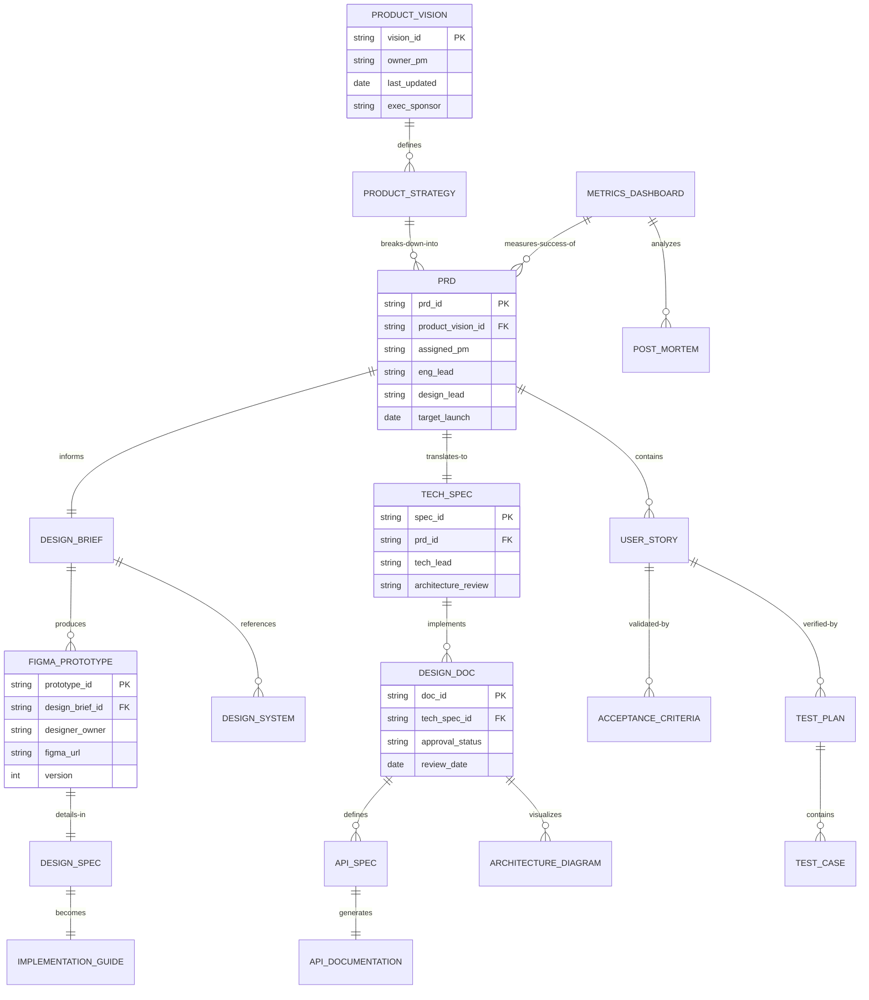
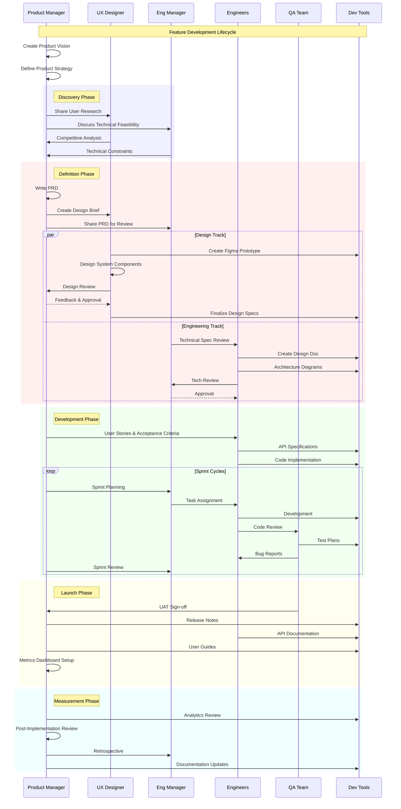
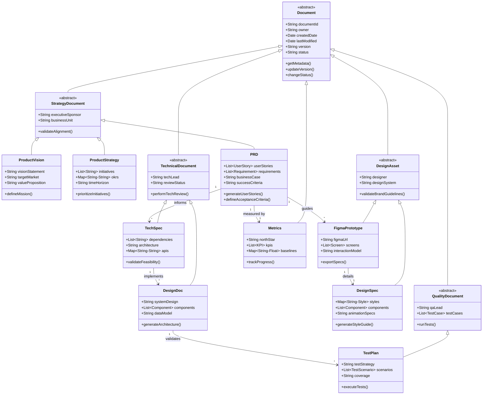
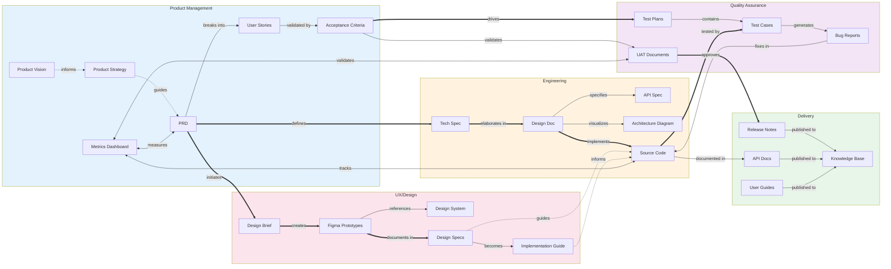
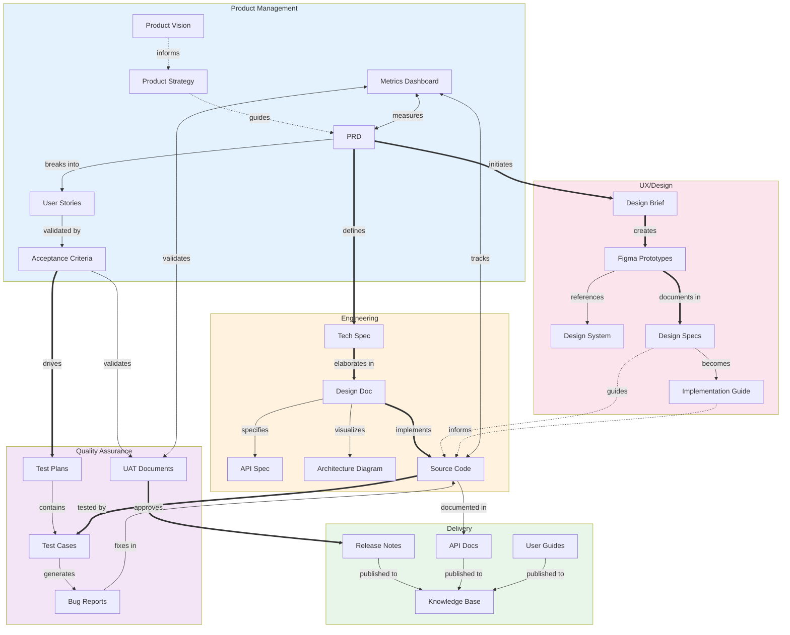

# Product Management Documents Diagrams

I'll create comprehensive Mermaid.js diagrams that visualize the interconnections between product management documentation and software development artifacts. These diagrams will illustrate how PM docs integrate with engineering and design assets in the development lifecycle.

## 1. Entity Relationship Diagram (ERD) - Document Relationships

## 2. Sequence Diagram - Feature Development Flow

## 3. Class Diagram - Document Type Hierarchy

## 4. Document Lifecycle Flow Chart

```mermaid
flowchart TB
    Start([New Feature Request]) --> Discovery{Discovery Phase}
    
    Discovery --> Research[User Research<br/>Market Analysis]
    Discovery --> Technical[Technical Feasibility<br/>Assessment]
    Discovery --> Competitive[Competitive Analysis]
    
    Research --> PRDDraft[PRD Draft Creation]
    Technical --> PRDDraft
    Competitive --> PRDDraft
    
    PRDDraft --> Review{Stakeholder<br/>Review}
    
    Review -->|Needs Revision| PRDDraft
    Review -->|Approved| PRDFinal[PRD Finalized<br/>v1.0]
    
    PRDFinal --> Parallel{Parallel Tracks}
    
    Parallel --> DesignTrack[Design Track]
    Parallel --> EngTrack[Engineering Track]
    
    DesignTrack --> DesignBrief[Design Brief<br/>Created]
    DesignBrief --> FigmaWork[Figma Prototypes<br/>Iterations]
    FigmaWork --> DesignReview{Design<br/>Review}
    DesignReview -->|Iterate| FigmaWork
    DesignReview -->|Approved| DesignSpecs[Design Specs<br/>Finalized]
    
    EngTrack --> TechSpec[Technical Spec<br/>Drafted]
    TechSpec --> ArchReview{Architecture<br/>Review}
    ArchReview -->|Revise| TechSpec
    ArchReview -->|Approved| DesignDocs[Design Docs<br/>Created]
    
    DesignSpecs --> DevReady{Development<br/>Ready}
    DesignDocs --> DevReady
    
    DevReady --> Sprint[Sprint Planning]
    Sprint --> UserStories[User Stories<br/>Created]
    UserStories --> Development[Development<br/>Implementation]
    
    Development --> CodeReview{Code<br/>Review}
    CodeReview -->|Failed| Development
    CodeReview -->|Passed| Testing[Test Plans<br/>Executed]
    
    Testing --> QAReview{QA<br/>Validation}
    QAReview -->|Bugs Found| Development
    QAReview -->|Passed| Documentation[Documentation<br/>Phase]
    
    Documentation --> APIDocs[API Documentation]
    Documentation --> UserGuides[User Guides]
    Documentation --> ReleaseNotes[Release Notes]
    
    APIDocs --> Launch{Launch<br/>Ready}
    UserGuides --> Launch
    ReleaseNotes --> Launch
    
    Launch --> Production[Deploy to<br/>Production]
    
    Production --> Monitoring[Metrics &<br/>Monitoring]
    Monitoring --> PostMortem[Post-Implementation<br/>Review]
    
    PostMortem --> Updates{Documentation<br/>Updates Needed?}
    Updates -->|Yes| UpdateDocs[Update All<br/>Related Docs]
    Updates -->|No| End([Feature Complete])
    UpdateDocs --> End
    
    style Start fill:#e1f5fe
    style End fill:#c8e6c9
    style Review fill:#fff3e0
    style DesignReview fill:#fff3e0
    style ArchReview fill:#fff3e0
    style CodeReview fill:#fff3e0
    style QAReview fill:#fff3e0
    style Launch fill:#ffecb3
    style Production fill:#a5d6a7
```

## 5. Integration Points Diagram - Document Touchpoints

These diagrams provide a comprehensive view of how product management documentation integrates with the broader software development ecosystem. The ERD shows the structural relationships between different document types, the sequence diagram illustrates the temporal flow of information, the class diagram demonstrates the hierarchical organization of documentation, and the lifecycle flowchart tracks documents through their evolution from inception to post-launch updates.

Each diagram serves a specific purpose in helping L6 PMs at Google understand how their documentation fits into the larger development process and how to optimize information flow across teams.

