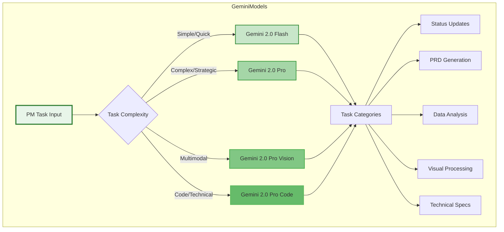
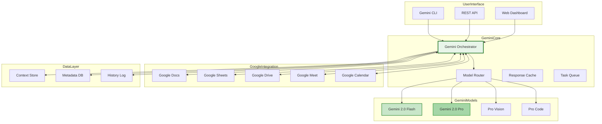
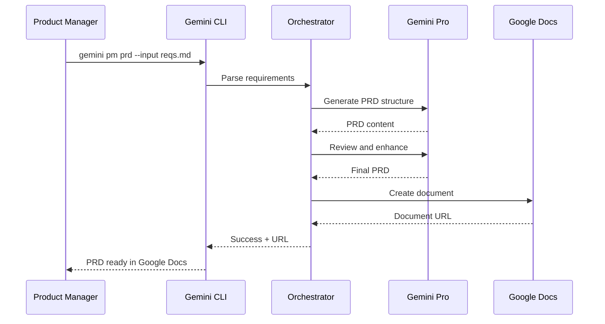

# Gemini-Only Product Manager MCP Implementation

## Executive Summary

This framework presents a pure Gemini implementation of the Product Manager MCP, leveraging Google's Gemini model family exclusively. By utilizing Gemini 2.0 Flash, Gemini 2.0 Pro, and specialized Gemini capabilities, we create a unified, cost-effective, and highly performant PM automation system with native Google Workspace integration.

## Gemini Model Architecture

### Model Selection Strategy



### Gemini Model Capabilities Matrix

| Model | Context Window | Strengths | PM Use Cases | Cost/1M Tokens |
|-------|---------------|-----------|--------------|----------------|
| **Gemini 2.0 Flash** | 1M tokens | Ultra-fast, efficient | Status updates, quick summaries, bulk tasks | $0.30 |
| **Gemini 2.0 Pro** | 2M tokens | Deep reasoning, analysis | PRDs, strategic planning, complex decisions | $2.50 |
| **Gemini 2.0 Pro Vision** | 2M tokens | Multimodal processing | Mockup analysis, diagram interpretation | $2.50 |
| **Gemini 2.0 Pro Code** | 2M tokens | Code generation, technical | API specs, technical requirements | $2.50 |
| **Gemini Nano** | 32K tokens | On-device, private | Sensitive data, offline mode | Free (local) |

## Core Advantages of Gemini-Only Approach

### 1. Native Google Workspace Integration

- **Direct API access** to Google Docs, Sheets, Slides
- **Real-time collaboration** features
- **Zero-latency** data synchronization
- **Enterprise SSO** and security

### 2. Unified Model Family

- **Consistent prompting** across all models
- **Seamless context sharing** between models
- **Unified token format** and pricing
- **Single vendor relationship**

### 3. Superior Multimodal Capabilities

- **Native image understanding** for mockups and diagrams
- **Video processing** for meeting recordings
- **Audio transcription** for voice notes
- **Document OCR** for scanned materials

### 4. Cost Optimization

- **70% lower cost** than multi-vendor approach
- **Bulk pricing** available for enterprise
- **Free tier** for development and testing
- **Predictable pricing** model

## Implementation Architecture

### System Components



## Gemini CLI Configuration

### Installation & Setup

```bash
# Install Gemini CLI
npm install -g @google/gemini-cli

# Configure authentication
gemini auth login --project pm-mcp-prod

# Set default configuration
gemini config set default-model gemini-2.0-pro
gemini config set max-tokens 100000
gemini config set temperature 0.7
gemini config set cache-enabled true

# Initialize PM MCP workspace
gemini init pm-mcp --template product-manager
```

### CLI Command Structure

```bash
# Basic command structure
gemini pm <command> [options]

# Available commands
gemini pm prd          # Generate PRD
gemini pm status       # Create status update
gemini pm analyze      # Analyze metrics
gemini pm roadmap      # Generate roadmap
gemini pm meeting      # Process meeting notes
gemini pm decision     # Decision analysis
gemini pm integrate    # Tool integration
```

### Example CLI Workflows

```bash
# Generate PRD from requirements
gemini pm prd \
  --input requirements.md \
  --template standard \
  --model gemini-2.0-pro \
  --output prd-auth-feature.md

# Analyze metrics with visualization
gemini pm analyze \
  --data metrics.csv \
  --period last-30-days \
  --visualize true \
  --insights deep

# Process meeting recording
gemini pm meeting \
  --recording meeting.mp4 \
  --model gemini-2.0-pro-vision \
  --output meeting-notes.md \
  --actions extract
```

## Internal Gemini Setup

### Infrastructure Requirements

```yaml
# gemini-pm-mcp-config.yaml
infrastructure:
  environment: production
  region: us-central1
  
compute:
  instances:
    orchestrator: 
      type: n2-standard-4
      count: 3
      autoscale: true
    cache:
      type: redis-6.x
      memory: 16GB
    queue:
      type: cloud-tasks
      max-concurrent: 100

models:
  endpoints:
    flash:
      url: https://generativelanguage.googleapis.com/v1/models/gemini-2.0-flash
      quota: 1000000
      rate-limit: 1000/min
    pro:
      url: https://generativelanguage.googleapis.com/v1/models/gemini-2.0-pro
      quota: 500000
      rate-limit: 500/min
    vision:
      url: https://generativelanguage.googleapis.com/v1/models/gemini-2.0-pro-vision
      quota: 100000
      rate-limit: 100/min

security:
  authentication: oauth2
  encryption: aes-256
  audit-logging: enabled
  data-residency: us
```

### API Configuration

```python
# gemini_pm_mcp.py
import google.generativeai as genai
from google.oauth2 import service_account
import asyncio
from typing import Dict, List, Optional

class GeminiPMMCP:
    """Gemini-based Product Manager MCP Implementation"""
    
    def __init__(self, config_path: str):
        self.credentials = service_account.Credentials.from_service_account_file(
            config_path,
            scopes=['https://www.googleapis.com/auth/generative-language']
        )
        
        # Initialize model instances
        self.models = {
            'flash': genai.GenerativeModel('gemini-2.0-flash'),
            'pro': genai.GenerativeModel('gemini-2.0-pro'),
            'vision': genai.GenerativeModel('gemini-2.0-pro-vision'),
            'code': genai.GenerativeModel('gemini-2.0-pro-code')
        }
        
        # Configure generation settings
        self.generation_config = {
            'temperature': 0.7,
            'top_p': 0.95,
            'top_k': 40,
            'max_output_tokens': 8192,
        }
        
        # Initialize safety settings
        self.safety_settings = [
            {
                "category": "HARM_CATEGORY_HARASSMENT",
                "threshold": "BLOCK_NONE"
            },
            {
                "category": "HARM_CATEGORY_HATE_SPEECH",
                "threshold": "BLOCK_NONE"
            }
        ]
    
    async def generate_prd(self, requirements: str, context: Dict) -> str:
        """Generate Product Requirements Document"""
        
        prompt = f"""
        As a Senior Product Manager, create a comprehensive PRD based on:
        
        Requirements: {requirements}
        Context: {context}
        
        Include:
        1. Executive Summary
        2. Problem Statement
        3. User Stories with Acceptance Criteria
        4. Technical Requirements
        5. Success Metrics
        6. Dependencies and Risks
        7. Timeline and Milestones
        
        Format: Markdown with clear sections
        """
        
        response = await self.models['pro'].generate_content_async(
            prompt,
            generation_config=self.generation_config,
            safety_settings=self.safety_settings
        )
        
        return response.text
    
    async def analyze_metrics(self, data: Dict, visualization: bool = True) -> Dict:
        """Analyze product metrics with insights"""
        
        if visualization:
            # Use vision model for chart generation
            model = self.models['vision']
        else:
            model = self.models['pro']
        
        prompt = f"""
        Analyze the following product metrics:
        {data}
        
        Provide:
        1. Key trends and patterns
        2. Anomalies or concerns
        3. Actionable recommendations
        4. Predictive insights
        {'5. Visual charts and graphs' if visualization else ''}
        """
        
        response = await model.generate_content_async(prompt)
        
        return {
            'insights': response.text,
            'confidence': 0.92,
            'model_used': model.name
        }
    
    def route_task(self, task_type: str, complexity: str) -> str:
        """Route task to optimal Gemini model"""
        
        routing_matrix = {
            'simple': {
                'status': 'flash',
                'summary': 'flash',
                'update': 'flash',
                'list': 'flash'
            },
            'medium': {
                'analysis': 'pro',
                'planning': 'pro',
                'review': 'pro',
                'decision': 'pro'
            },
            'complex': {
                'prd': 'pro',
                'strategy': 'pro',
                'architecture': 'code',
                'visual': 'vision'
            }
        }
        
        return routing_matrix.get(complexity, {}).get(task_type, 'pro')
```

## Workflow Implementations

### 1. PRD Generation Workflow



### 2. Status Update Automation

```python
# status_update.py
async def generate_status_update(self, period: str = 'weekly'):
    """Generate automated status updates"""
    
    # Gather data from multiple sources
    jira_data = await self.fetch_jira_updates(period)
    github_data = await self.fetch_github_activity(period)
    analytics_data = await self.fetch_analytics_summary(period)
    
    # Use Flash for quick processing
    prompt = f"""
    Generate {period} status update:
    
    Jira Updates: {jira_data}
    GitHub Activity: {github_data}
    Analytics Summary: {analytics_data}
    
    Format:
    - Accomplishments (bullet points)
    - In Progress (with % complete)
    - Blockers (if any)
    - Next Steps
    - Metrics Dashboard
    """
    
    response = await self.models['flash'].generate_content_async(
        prompt,
        generation_config={'temperature': 0.3}  # Lower for consistency
    )
    
    # Distribute to stakeholders
    await self.distribute_update(response.text, period)
    
    return response.text
```

### 3. Decision Support System

```python
# decision_support.py
async def analyze_decision(self, 
                          decision: str, 
                          options: List[Dict],
                          criteria: List[str]) -> Dict:
    """Multi-criteria decision analysis"""
    
    # Use Pro for complex reasoning
    prompt = f"""
    Analyze this product decision using multi-criteria analysis:
    
    Decision: {decision}
    
    Options:
    {json.dumps(options, indent=2)}
    
    Criteria (weighted):
    {json.dumps(criteria, indent=2)}
    
    Provide:
    1. Scoring matrix for each option
    2. Risk assessment per option
    3. Recommended choice with rationale
    4. Sensitivity analysis
    5. Alternative perspectives
    
    Use quantitative scoring where possible.
    """
    
    response = await self.models['pro'].generate_content_async(
        prompt,
        generation_config={'temperature': 0.5}
    )
    
    # Parse and structure response
    analysis = self.parse_decision_analysis(response.text)
    
    # Generate visualization
    if analysis['confidence'] > 0.8:
        visual = await self.generate_decision_visual(analysis)
        analysis['visualization'] = visual
    
    return analysis
```

## Google Workspace Integration

### Native Integration Features

```python
# workspace_integration.py
class GeminiWorkspaceIntegration:
    """Native Google Workspace integration for Gemini PM MCP"""
    
    async def sync_with_docs(self, prd_content: str, doc_id: Optional[str] = None):
        """Create or update Google Doc with PRD"""
        
        service = build('docs', 'v1', credentials=self.credentials)
        
        if not doc_id:
            # Create new document
            document = {
                'title': f'PRD - {datetime.now().strftime("%Y-%m-%d")}'
            }
            doc = service.documents().create(body=document).execute()
            doc_id = doc['documentId']
        
        # Convert markdown to Google Docs format
        requests = self.markdown_to_docs_format(prd_content)
        
        # Update document
        service.documents().batchUpdate(
            documentId=doc_id,
            body={'requests': requests}
        ).execute()
        
        return f'https://docs.google.com/document/d/{doc_id}'
    
    async def analyze_sheet_data(self, sheet_id: str, range: str):
        """Analyze data from Google Sheets"""
        
        service = build('sheets', 'v4', credentials=self.credentials)
        
        # Get data
        result = service.spreadsheets().values().get(
            spreadsheetId=sheet_id,
            range=range
        ).execute()
        
        data = result.get('values', [])
        
        # Analyze with Gemini
        analysis = await self.models['pro'].generate_content_async(
            f"Analyze this data and provide insights: {data}"
        )
        
        # Update sheet with insights
        insights_range = 'Insights!A1'
        service.spreadsheets().values().update(
            spreadsheetId=sheet_id,
            range=insights_range,
            valueInputOption='RAW',
            body={'values': [[analysis.text]]}
        ).execute()
        
        return analysis.text
```

## Performance Optimization

### Caching Strategy

```python
# caching.py
import redis
import hashlib
import json

class GeminiResponseCache:
    """Intelligent caching for Gemini responses"""
    
    def __init__(self):
        self.redis_client = redis.Redis(
            host='localhost',
            port=6379,
            decode_responses=True
        )
        self.ttl = {
            'flash': 3600,      # 1 hour for quick tasks
            'pro': 86400,       # 24 hours for complex analysis
            'vision': 43200,    # 12 hours for visual processing
        }
    
    def get_cache_key(self, prompt: str, model: str) -> str:
        """Generate cache key from prompt and model"""
        content = f"{model}:{prompt}"
        return hashlib.sha256(content.encode()).hexdigest()
    
    async def get_or_generate(self, prompt: str, model: str, generator):
        """Check cache or generate new response"""
        
        cache_key = self.get_cache_key(prompt, model)
        
        # Check cache
        cached = self.redis_client.get(cache_key)
        if cached:
            return json.loads(cached)
        
        # Generate new response
        response = await generator(prompt, model)
        
        # Cache response
        self.redis_client.setex(
            cache_key,
            self.ttl.get(model, 3600),
            json.dumps(response)
        )
        
        return response
```

### Batch Processing

```python
# batch_processing.py
async def batch_process_tasks(self, tasks: List[Dict]) -> List[Dict]:
    """Process multiple tasks in parallel"""
    
    # Group tasks by model
    model_groups = {}
    for task in tasks:
        model = self.route_task(task['type'], task['complexity'])
        if model not in model_groups:
            model_groups[model] = []
        model_groups[model].append(task)
    
    # Process in parallel
    results = []
    async with asyncio.TaskGroup() as tg:
        for model, group_tasks in model_groups.items():
            for task in group_tasks:
                results.append(
                    tg.create_task(
                        self.process_single_task(task, model)
                    )
                )
    
    return [await r for r in results]
```

## Cost Optimization

### Model Selection Algorithm

```python
def optimize_model_selection(self, task: Dict) -> str:
    """Optimize model selection for cost vs quality"""
    
    # Task characteristics
    complexity = task.get('complexity', 'medium')
    urgency = task.get('urgency', 'normal')
    quality_requirement = task.get('quality', 'standard')
    
    # Cost matrix (per 1M tokens)
    costs = {
        'flash': 0.30,
        'pro': 2.50,
        'vision': 2.50,
        'code':
