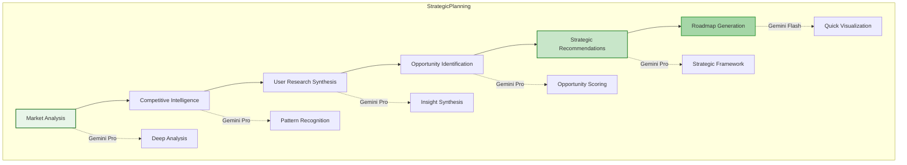

# Gemini PM Workflows: Complete Automation Guide

## Executive Summary

This document provides comprehensive workflow implementations for Product Managers using Gemini models exclusively. Each workflow is optimized for Gemini's strengths, leveraging the appropriate model variant for maximum efficiency and quality.

## Core PM Workflows

### 1. Strategic Planning Workflow



#### Implementation

```python
# strategic_planning_workflow.py
import asyncio
from typing import Dict, List, Optional
from datetime import datetime
import google.generativeai as genai

class GeminiStrategicPlanningWorkflow:
    """Strategic planning workflow using Gemini models"""
    
    def __init__(self, api_key: str):
        genai.configure(api_key=api_key)
        self.pro_model = genai.GenerativeModel('gemini-2.0-pro')
        self.flash_model = genai.GenerativeModel('gemini-2.0-flash')
        self.vision_model = genai.GenerativeModel('gemini-2.0-pro-vision')
        
    async def execute_strategic_planning(self, 
                                        quarter: str,
                                        context: Dict) -> Dict:
        """Execute complete strategic planning workflow"""
        
        print(f"Starting strategic planning for {quarter}")
        
        # Phase 1: Market Analysis
        market_analysis = await self.analyze_market(context.get('market_data'))
        
        # Phase 2: Competitive Intelligence
        competitive_intel = await self.analyze_competition(
            context.get('competitors'),
            market_analysis
        )
        
        # Phase 3: User Research Synthesis
        user_insights = await self.synthesize_user_research(
            context.get('user_data'),
            context.get('feedback')
        )
        
        # Phase 4: Opportunity Identification
        opportunities = await self.identify_opportunities(
            market_analysis,
            competitive_intel,
            user_insights
        )
        
        # Phase 5: Strategic Recommendations
        strategy = await self.generate_strategy(opportunities, quarter)
        
        # Phase 6: Roadmap Generation
        roadmap = await self.create_roadmap(strategy, quarter)
        
        return {
            'quarter': quarter,
            'market_analysis': market_analysis,
            'competitive_intel': competitive_intel,
            'user_insights': user_insights,
            'opportunities': opportunities,
            'strategy': strategy,
            'roadmap': roadmap,
            'generated_at': datetime.now().isoformat()
        }
    
    async def analyze_market(self, market_data: Dict) -> Dict:
        """Deep market analysis using Gemini Pro"""
        
        prompt = f"""
        Conduct comprehensive market analysis:
        
        Market Data: {market_data}
        
        Analyze:
        1. Market Size and Growth
        2. Key Trends and Drivers
        3. Customer Segments
        4. Regulatory Environment
        5. Technology Disruptions
        6. Economic Factors
        
        Provide:
        - TAM, SAM, SOM calculations
        - Growth projections (3-year)
        - Risk factors
        - Opportunity windows
        
        Format: Structured JSON
        """
        
        response = await self.pro_model.generate_content_async(
            prompt,
            generation_config={'temperature': 0.7, 'max_output_tokens': 8192}
        )
        
        return self._parse_json_response(response.text)
```

### 2. PRD Generation Workflow

```python
# prd_generation_workflow.py
class GeminiPRDWorkflow:
    """Comprehensive PRD generation using Gemini models"""
    
    async def generate_prd(self, 
                          feature_name: str,
                          requirements: Dict,
                          context: Optional[Dict] = None) -> str:
        """Generate complete PRD with all sections"""
        
        workflow_stages = [
            ('problem_definition', self.define_problem),
            ('user_research', self.synthesize_user_research),
            ('solution_design', self.design_solution),
            ('technical_specs', self.generate_technical_specs),
            ('success_metrics', self.define_success_metrics),
            ('implementation_plan', self.create_implementation_plan),
            ('risk_assessment', self.assess_risks),
            ('consolidation', self.consolidate_prd)
        ]
        
        results = {}
        
        for stage_name, stage_func in workflow_stages:
            print(f"Executing: {stage_name}")
            results[stage_name] = await stage_func(
                feature_name, 
                requirements, 
                context,
                results  # Pass previous results
            )
        
        return results['consolidation']
    
    async def define_problem(self, feature_name: str, requirements: Dict, 
                            context: Dict, previous: Dict) -> Dict:
        """Define problem statement using Gemini Pro"""
        
        prompt = f"""
        Define the problem statement for {feature_name}:
        
        Requirements: {requirements}
        Context: {context}
        
        Include:
        1. Problem Description
        2. User Pain Points
        3. Business Impact
        4. Current State vs Desired State
        5. Success Criteria
        
        Format: Clear, concise problem statement with supporting data
        """
        
        response = await self.pro_model.generate_content_async(prompt)
        
        return {
            'problem_statement': response.text,
            'identified_pain_points': self._extract_pain_points(response.text),
            'business_impact': self._extract_business_impact(response.text)
        }
    
    async def generate_technical_specs(self, feature_name: str, requirements: Dict,
                                      context: Dict, previous: Dict) -> Dict:
        """Generate technical specifications using Gemini Pro Code"""
        
        code_model = genai.GenerativeModel('gemini-2.0-pro-code')
        
        prompt = f"""
        Generate technical specifications for {feature_name}:
        
        Problem: {previous['problem_definition']['problem_statement']}
        Solution: {previous['solution_design']['solution']}
        
        Provide:
        1. API Specifications (OpenAPI format)
        2. Database Schema Changes
        3. System Architecture Updates
        4. Integration Points
        5. Performance Requirements
        6. Security Considerations
        
        Format: Technical documentation with code examples
        """
        
        response = await code_model.generate_content_async(prompt)
        
        return {
            'api_specs': self._extract_api_specs(response.text),
            'database_schema': self._extract_schema(response.text),
            'architecture': self._extract_architecture(response.text),
            'integrations': self._extract_integrations(response.text),
            'performance_reqs': self._extract_performance(response.text),
            'security': self._extract_security(response.text)
        }
```

### 3. Sprint Management Workflow

```python
# sprint_management_workflow.py
class GeminiSprintWorkflow:
    """Sprint planning and management using Gemini"""
    
    async def plan_sprint(self, sprint_number: int, team_capacity: int) -> Dict:
        """Complete sprint planning workflow"""
        
        # Step 1: Analyze backlog
        backlog_analysis = await self.analyze_backlog()
        
        # Step 2: Prioritize items
        prioritized_items = await self.prioritize_items(
            backlog_analysis,
            team_capacity
        )
        
        # Step 3: Generate sprint goals
        sprint_goals = await self.generate_sprint_goals(prioritized_items)
        
        # Step 4: Create sprint plan
        sprint_plan = await self.create_sprint_plan(
            sprint_number,
            prioritized_items,
            sprint_goals
        )
        
        # Step 5: Identify risks
        risks = await self.identify_sprint_risks(sprint_plan)
        
        # Step 6: Generate communication
        communication = await self.generate_sprint_communication(
            sprint_plan,
            risks
        )
        
        return {
            'sprint_number': sprint_number,
            'capacity': team_capacity,
            'items': prioritized_items,
            'goals': sprint_goals,
            'plan': sprint_plan,
            'risks': risks,
            'communication': communication
        }
    
    async def prioritize_items(self, backlog: List[Dict], capacity: int) -> List[Dict]:
        """Prioritize backlog items using Gemini Pro"""
        
        prompt = f"""
        Prioritize backlog items for sprint planning:
        
        Backlog Items: {backlog}
        Team Capacity: {capacity} story points
        
        Apply prioritization framework:
        1. RICE Score calculation
        2. Dependencies analysis
        3. Technical debt balance (20% allocation)
        4. Risk assessment
        5. Business value alignment
        
        Return:
        - Prioritized list fitting capacity
        - Justification for each selection
        - Items moved to next sprint
        
        Format: JSON with detailed scoring
        """
        
        response = await self.pro_model.generate_content_async(
            prompt,
            generation_config={'temperature': 0.5}
        )
        
        return self._parse_prioritized_items(response.text)
```

### 4. Metrics Analysis Workflow

```python
# metrics_analysis_workflow.py
class GeminiMetricsWorkflow:
    """Product metrics analysis using Gemini"""
    
    async def analyze_product_metrics(self, 
                                     metrics_data: Dict,
                                     period: str = 'last_30_days') -> Dict:
        """Complete metrics analysis workflow"""
        
        analysis_pipeline = [
            self.calculate_key_metrics,
            self.identify_trends,
            self.detect_anomalies,
            self.cohort_analysis,
            self.funnel_analysis,
            self.generate_insights,
            self.create_recommendations,
            self.visualize_data
        ]
        
        results = {'raw_data': metrics_data, 'period': period}
        
        for analysis_func in analysis_pipeline:
            stage_name = analysis_func.__name__
            print(f"Executing: {stage_name}")
            results[stage_name] = await analysis_func(results)
        
        return results
    
    async def identify_trends(self, data: Dict) -> Dict:
        """Identify trends using Gemini Pro"""
        
        prompt = f"""
        Analyze product metrics for trends:
        
        Metrics: {data['calculate_key_metrics']}
        Period: {data['period']}
        
        Identify:
        1. Growth trends (MoM, WoW)
        2. Seasonality patterns
        3. User behavior changes
        4. Feature adoption curves
        5. Retention patterns
        
        Statistical Analysis:
        - Moving averages
        - Trend significance (p-values)
        - Forecast next 30 days
        
        Format: JSON with visualizable data points
        """
        
        response = await self.pro_model.generate_content_async(prompt)
        
        return {
            'trends': self._parse_trends(response.text),
            'forecasts': self._extract_forecasts(response.text),
            'significance': self._calculate_significance(response.text)
        }
    
    async def visualize_data(self, data: Dict) -> Dict:
        """Generate visualization recommendations using Gemini Vision"""
        
        # If we have existing charts, analyze them
        if 'charts' in data:
            prompt = f"""
            Analyze these metric visualizations and suggest improvements:
            
            Current visualizations: {data.get('charts')}
            Key insights: {data['generate_insights']}
            
            Recommend:
            1. Chart types for each metric
            2. Dashboard layout
            3. Color schemes for clarity
            4. Interactive elements
            5. Mobile optimization
            
            Format: Visualization specification
            """
            
            response = await self.vision_model.generate_content_async(prompt)
        else:
            # Generate visualization specs from scratch
            prompt = f"""
            Create visualization specifications for these metrics:
            
            Metrics: {data['calculate_key_metrics']}
            Trends: {data['identify_trends']}
            Insights: {data['generate_insights']}
            
            Generate:
            1. Chart specifications (type, axes, data)
            2. Dashboard layout (grid system)
            3. Interactive elements
            4. Export formats
            
            Format: JSON specification for charting library
            """
            
            response = await self.flash_model.generate_content_async(prompt)
        
        return self._parse_visualization_spec(response.text)
```

### 5. Stakeholder Communication Workflow

```python
# stakeholder_communication_workflow.py
class GeminiCommunicationWorkflow:
    """Automated stakeholder communication using Gemini"""
    
    async def generate_stakeholder_updates(self, week_number: int) -> Dict:
        """Generate all stakeholder communications for the week"""
        
        # Gather context
        context = await self.gather_weekly_context(week_number)
        
        # Generate updates for different audiences
        updates = {
            'executive': await self.generate_executive_update(context),
            'engineering': await self.generate_engineering_update(context),
            'sales': await self.generate_sales_update(context),
            'customer_success': await self.generate_cs_update(context),
            'team': await self.generate_team_update(context)
        }
        
        # Create presentation materials
        presentations = await self.create_presentations(updates)
        
        # Schedule distribution
        distribution = await self.schedule_distribution(updates, presentations)
        
        return {
            'week': week_number,
            'updates': updates,
            'presentations': presentations,
            'distribution': distribution
        }
    
    async def generate_executive_update(self, context: Dict) -> str:
        """Generate executive-level update using Gemini Pro"""
        
        prompt = f"""
        Create executive status update:
        
        Week: {context['week_number']}
        Metrics: {context['metrics']}
        Milestones: {context['milestones']}
        Issues: {context['issues']}
        
        Format:
        1. Executive Summary (3 bullets max)
        2. Key Metrics (visual indicators)
        3. Milestone Status (on-track/at-risk/blocked)
        4. Critical Decisions Needed
        5. Next Week Focus
        
        Tone: Professional, concise, action-oriented
        Length: 300 words maximum
        Include: Clear CTAs for any decisions needed
        """
        
        response = await self.pro_model.generate_content_async(
            prompt,
            generation_config={'temperature': 0.3}  # Lower temperature for consistency
        )
        
        return response.text
    
    async def generate_engineering_update(self, context: Dict) -> str:
        """Generate engineering-focused update using Gemini Pro Code"""
        
        code_model = genai.GenerativeModel('gemini-2.0-pro-code')
        
        prompt = f"""
        Create engineering team update:
        
        Sprint Progress: {context['sprint_progress']}
        Technical Metrics: {context['tech_metrics']}
        Deployments: {context['deployments']}
        Incidents: {context['incidents']}
        
        Include:
        1. Sprint velocity and burndown
        2. Code quality metrics
        3. Technical debt status
        4. Infrastructure updates
        5. Upcoming technical decisions
        6. API/Integration changes
        
        Format: Technical but accessible
        Include: Code snippets where relevant
        """
        
        response = await code_model.generate_content_async(prompt)
        
        return response.text
```

### 6. User Research Synthesis Workflow

```python
# user_research_workflow.py
class GeminiUserResearchWorkflow:
    """User research synthesis using Gemini"""
    
    async def synthesize_user_research(self, 
                                      research_data: Dict,
                                      research_type: str) -> Dict:
        """Complete user research synthesis workflow"""
        
        synthesis_pipeline = {
            'interviews': self.synthesize_interviews,
            'surveys': self.analyze_surveys,
            'usability': self.process_usability_tests,
            'analytics': self.behavioral_analysis,
            'feedback': self.categorize_feedback
        }
        
        # Run appropriate synthesis based on research type
        if research_type == 'comprehensive':
            results = {}
            for rtype, func in synthesis_pipeline.items():
                if rtype in research_data:
                    results[rtype] = await func(research_data[rtype])
            
            # Cross-synthesis
            results['insights'] = await self.cross_synthesize(results)
            results['personas'] = await self.update_personas(results)
            results['recommendations'] = await self.generate_recommendations(results)
        else:
            func = synthesis_pipeline.get(research_type)
            results = await func(research_data)
        
        return results
    
    async def synthesize_interviews(self, interview_data: List[Dict]) -> Dict:
        """Synthesize user interviews using Gemini Pro"""
        
        prompt = f"""
        Synthesize user interview data:
        
        Interviews: {interview_data}
        
        Extract:
        1. Common themes and patterns
        2. Pain points (frequency and severity)
        3. Jobs to be done
        4. Feature requests and desires
        5. Workflow descriptions
        6. Emotional responses
        7. Quotes and key insights
        
        Analysis Framework:
        - Affinity mapping
        - Theme saturation
        - Sentiment analysis
        - Priority matrix
        
        Format: Structured insights with evidence
        """
        
        response = await self.pro_model.generate_content_async(
            prompt,
            generation_config={'temperature': 0.6}
        )
        
        return {
            'themes': self._extract_themes(response.text),
            'pain_points': self._extract_pain_points(response.text),
            'jobs_to_be_done': self._extract_jtbd(response.text),
            'quotes': self._extract_quotes(response.text),
            'synthesis': response.text
        }
```

### 7. Competitive Analysis Workflow

```python
# competitive_analysis_workflow.py
class GeminiCompetitiveAnalysisWorkflow:
    """Competitive analysis using Gemini"""
    
    async def analyze_competition(self, competitors: List[str]) -> Dict:
        """Complete competitive analysis workflow"""
        
        analysis_results = {}
        
        for competitor in competitors:
            print(f"Analyzing competitor: {competitor}")
            
            # Gather competitive intelligence
            intel = await self.gather_competitive_intel(competitor)
            
            # Analyze product features
            features = await self.analyze_product_features(competitor, intel)
            
            # Analyze pricing strategy
            pricing = await self.analyze_pricing(competitor, intel)
            
            # Analyze market positioning
            positioning = await self.analyze_positioning(competitor, intel)
            
            # Analyze strengths and weaknesses
            swot = await self.perform_swot_analysis(competitor, intel)
            
            analysis_results[competitor] = {
                'intel': intel,
                'features': features,
                'pricing': pricing,
                'positioning': positioning,
                'swot': swot
            }
        
        # Comparative analysis
        comparison = await self.comparative_analysis(analysis_results)
        
        # Strategic recommendations
        strategy = await self.strategic_recommendations(comparison)
        
        return {
            'competitors': analysis_results,
            'comparison': comparison,
            'strategy': strategy
        }
    
    async def analyze_product_features(self, competitor: str, intel: Dict) -> Dict:
        """Analyze competitor product features using Gemini Pro"""
        
        prompt = f"""
        Analyze {competitor} product features:
        
        Intelligence: {intel}
        
        Evaluate:
        1. Core feature set
        2. Unique differentiators
        3. Feature maturity
        4. Innovation pipeline
        5. Technical capabilities
        6. User experience quality
        7. Platform coverage
        
        Comparison Framework:
        - Feature parity analysis
        - Capability gaps
        - Competitive advantages
        - Time to market for features
        
        Format: Detailed feature matrix with scoring
        """
        
        response = await self.pro_model.generate_content_async(prompt)
        
        return self._parse_feature_analysis(response.text)
```

## Workflow Orchestration

### Master Orchestrator

```python
# workflow_orchestrator.py
class GeminiWorkflowOrchestrator:
    """Master orchestrator for all PM workflows"""
    
    def __init__(self, api_key: str):
        self.strategic = GeminiStrategicPlanningWorkflow(api_key)
        self.prd = GeminiPRDWorkflow(api_key)
        self.sprint = GeminiSprintWorkflow(api_key)
        self.metrics = GeminiMetricsWorkflow(api_key)
        self.communication = GeminiCommunicationWorkflow(api_key)
        self.research = GeminiUserResearchWorkflow(api_key)
        self.competitive = GeminiCompetitiveAnalysisWorkflow(api_key)
        
        self.workflow_registry = {
            'strategic_planning': self.strategic.execute_strategic_planning,
            'prd_generation': self.prd.generate_prd,
            'sprint_planning': self.sprint.plan_sprint,
            'metrics_analysis': self.metrics.analyze_product_metrics,
            'stakeholder_updates': self.communication.generate_stakeholder_updates,
            'user_research': self.research.synthesize_user_research,
            'competitive_analysis': self.competitive.analyze_competition
        }
    
    async def execute_workflow(self, 
                              workflow_name: str,
                              params: Dict) -> Dict:
        """Execute a specific workflow with parameters"""
        
        if workflow_name not in self.workflow_registry:
            raise ValueError(f"Unknown workflow: {workflow_name}")
        
        workflow_func = self.workflow_registry[workflow_name]
        
        start_time = datetime.now()
        
        try:
            result = await workflow_func(**params)
            
            execution_time = (datetime.now() - start_time).total_seconds()
            
            return {
                'success': True,
                'workflow': workflow_name,
                'result': result,
                'execution_time': execution_time,
                'timestamp': datetime.now().isoformat()
            }
            
        except Exception as e:
            return {
                'success': False,
                'workflow': workflow_name,
                'error': str(e),
                'timestamp': datetime.now().isoformat()
            }
    
    async def execute_chain(self, workflows: List[Dict]) -> List[Dict]:
        """Execute multiple workflows in sequence"""
        
        results = []
        context = {}
        
        for workflow in workflows:
            name = workflow['name']
            params = workflow.get('params', {})
            
            # Add context from previous workflows
            params['context'] = context
            
            result = await self.execute_workflow(name, params)
            results.append(result)
            
            # Update context for next workflow
            if result['success']:
                context[name] = result['result']
        
        return results
    
    async def execute_parallel(self, workflows: List[Dict]) -> List[Dict]:
        """Execute multiple workflows in parallel"""
        
        tasks = []
        
        async with asyncio.TaskGroup() as tg:
            for workflow in workflows:
                task = tg.create_task(
                    self.execute_workflow(
                        workflow['name'],
                        workflow.get('params', {})
                    )
                )
                tasks.append(task)
        
        return [await task for task in tasks]
```

## Automation Scripts

### Daily PM Automation

```bash
#!/bin/bash
# daily_pm_automation.sh

# Morning routine
echo "Starting daily PM automation..."

# 1. Metrics collection and analysis
python3 << EOF
import asyncio
from workflow_orchestrator import GeminiWorkflowOrchestrator

async def morning_metrics():
    orchestrator = GeminiWorkflowOrchestrator(api_key="$GEMINI_API_KEY")
    
    # Analyze overnight metrics
    metrics_result = await orchestrator.execute_workflow(
        'metrics_analysis',
        {'period': 'last_24_hours', 'alert_on_anomaly': True}
    )
    
    # Generate morning status
    status_result = await orchestrator.execute_workflow(
        'stakeholder_updates',
        {'type': 'daily', 'audience': 'team'}
    )
    
    return metrics_result, status_result

results = asyncio.run(morning_metrics())
print(f"Metrics analyzed: {results[0]['success']}")
print(f"Status generated: {results[1]['success']}")
EOF

# 2. Task prioritization
gemini-cli workflow run daily-prioritization \
  --backlog-source jira \
  --method "impact-effort" \
  --output priorities.json

# 3. Calendar preparation
gemini-cli calendar prepare \
  --meetings today \
  --generate-agendas true \
  --prep-time 5min

# 4. Risk scanning
gemini-cli risk scan \
  --projects active \
  --severity medium+ \
  --notify-if critical

echo "Daily automation complete!"
```

### Weekly Planning Automation

```python
# weekly_planning.py
import asyncio
from datetime import datetime, timedelta
import json

async def weekly_planning_automation(week_number: int):
    """Complete weekly planning automation"""
    
    orchestrator = GeminiWorkflowOrchestrator(api_key=os.environ['GEMINI_API_KEY'])
    
    # Define workflow chain
    workflow_chain = [
        {
            'name': 'metrics_analysis',
            'params': {
                'period': 'last_7_days',
                'comparison': 'previous_week'
            }
        },
        {
            'name': 'user_research',
            'params': {
                'research_type': 'feedback',
                'period': f'week_{week_number}'
            }
        },
        {
            'name': 'competitive_analysis',
            'params': {
                'competitors': ['CompetitorA', 'CompetitorB'],
                'focus': 'recent_updates'
            }
        },
        {
            'name': 'strategic_planning',
            'params': {
                'horizon': 'weekly',
                'week': week_number
            }
        },
        {
            'name': 'stakeholder_updates',
            'params': {
                'week_number': week_number,
                'type': 'weekly'
            }
        }
    ]
    
    # Execute chain
    results = await orchestrator.execute_chain(workflow_chain)
    
    # Save results
    with open(f'week_{week_number}_planning.json', 'w') as f:
        json.dump(results, f, indent=2)
    
    # Generate summary report
    summary = await generate_weekly_summary(results)
    
    # Distribute
    await distribute_weekly_plan(summary, week_number)
    
    return results

async def generate_weekly_summary(results: List[Dict]) -> str:
    """Generate executive summary of weekly planning"""
    
    flash_model = genai.GenerativeModel('gemini-2.0-flash')
    
    prompt = f"""
    Create executive summary of weekly planning:
    
    Results: {json.dumps(results, indent=2)}
    
    Format:
    1. Key Decisions Made
    2. Priority Changes
    3. Risk Updates
    4. Action Items
    5. Success Metrics
    
    Length: 500 words max
    Tone: Professional, action-oriented
    """
    
    response = await flash_model.generate_content_async(prompt)
    return response.text

if __name__ == "__main__":
    import sys
    week = int(sys.argv[1]) if len(sys.argv) > 1 else datetime.now().isocalendar()[1]
    asyncio.run(weekly_planning_automation(week))
```

## Performance Monitoring

### Workflow Performance Metrics

```python
# performance_monitoring.py
class WorkflowPerformanceMonitor:
    """Monitor and optimize workflow performance"""
    
    def __init__(self):
        self.metrics = {
            'execution_times': {},
            'token_usage': {},
            'error_rates': {},
            'cache_hits': {}
        }
    
    async def monitor_workflow(self, workflow_name: str, func, *args, **kwargs):
        """Monitor workflow execution"""
        
        start_time = time.time()
        start_tokens = self.get_token_count()
        
        try:
            result = await func(*args, **kwargs)
            success = True
            error = None
        except Exception as e:
            result = None
            success = False
            error = str(e)
        
        execution_time = time.time() - start_time
        tokens_used = self.get_token_count() - start_tokens
        
        # Record metrics
        self.record_metric('execution_times', workflow_name, execution_time)
        self.record_metric('token_usage', workflow_name, tokens_used)
        
        if not success:
            self.record_error(workflow_name, error)
        
        # Check performance thresholds
        self.check_thresholds(workflow_name, execution_time, tokens_used)
        
        return result
    
    def generate_performance_report(self) -> Dict:
        """Generate performance report"""
        
        report = {
            'summary': {
                'total_executions': sum(len(v) for v in self.metrics['execution_times'].values()),
                'average_execution_time': self.calculate_average('execution_times'),
                'total_tokens': sum(sum(v) for v in self.metrics['token_usage'].values()),
                'error_rate': self.calculate_error_rate()
            },
            'by_workflow': {}
        }
        
        for workflow in self.metrics['execution_times'].keys():
            report['by_workflow'][workflow] = {
                'avg_time': np.mean(self.metrics['execution_times'][workflow]),
                'p95_time': np.percentile(self.metrics['execution_times'][workflow], 95),
                'avg_tokens': np.mean(self.metrics['token_usage'].get(workflow, [0])),
                'error_count': len(self.metrics['error_rates'].get(workflow, []))
            }
        
        return report
```

## Best Practices

### 1. Model Selection Guidelines

| Task Type | Recommended Model | Rationale |
|-----------|------------------|-----------|
| Quick summaries | Gemini Flash | Speed and cost efficiency |
| Deep analysis | Gemini Pro | Complex reasoning capability |
| Visual processing | Gemini Pro Vision | Multimodal understanding |
| Code generation | Gemini Pro Code | Technical accuracy |
| Bulk operations | Gemini Flash | Cost optimization |
| Critical decisions | Gemini Pro | Accuracy priority |

### 2. Error Handling

```python
async def robust_workflow_execution(workflow_func, max_retries=3):
    """Execute workflow with robust error handling"""
    
    for attempt in range(max_retries):
        try:
            return await workflow_func()
        except RateLimitError:
            wait_time = 2 ** attempt
            await asyncio.sleep(wait_time)
        except ModelTimeoutError:
            # Fallback to Flash model
            return await workflow_func(model_override='flash')
        except Exception as e:
            if attempt == max_retries - 1:
                raise
            logging.warning(f"Attempt {attempt + 1} failed: {e}")
```

### 3. Caching Strategy

```python
class IntelligentCache:
    """Smart caching for Gemini workflows"""
    
    def __init__(self):
        self.cache = {}
        self.ttl = {
            'metrics': 3600,      # 1 hour
            'research': 86400,    # 24 hours
            'competitive': 604800, # 1 week
            'strategic': 2592000  # 30 days
        }
    
    def should_cache(self, workflow_type: str, params: Dict) -> bool:
        """Determine if result should be cached"""
        
        # Don't cache real-time data
        if params.get('real_time'):
            return False
        
        # Don't cache personalized content
        if params.get('personalized'):
            return False
        
        # Cache based on workflow type
        return workflow_type in self.ttl
```

## Conclusion

This comprehensive workflow guide demonstrates how to leverage Gemini's model family for complete PM automation. By using the appropriate model for each task and implementing robust orchestration, PMs can achieve significant productivity gains while maintaining high-quality outputs.
